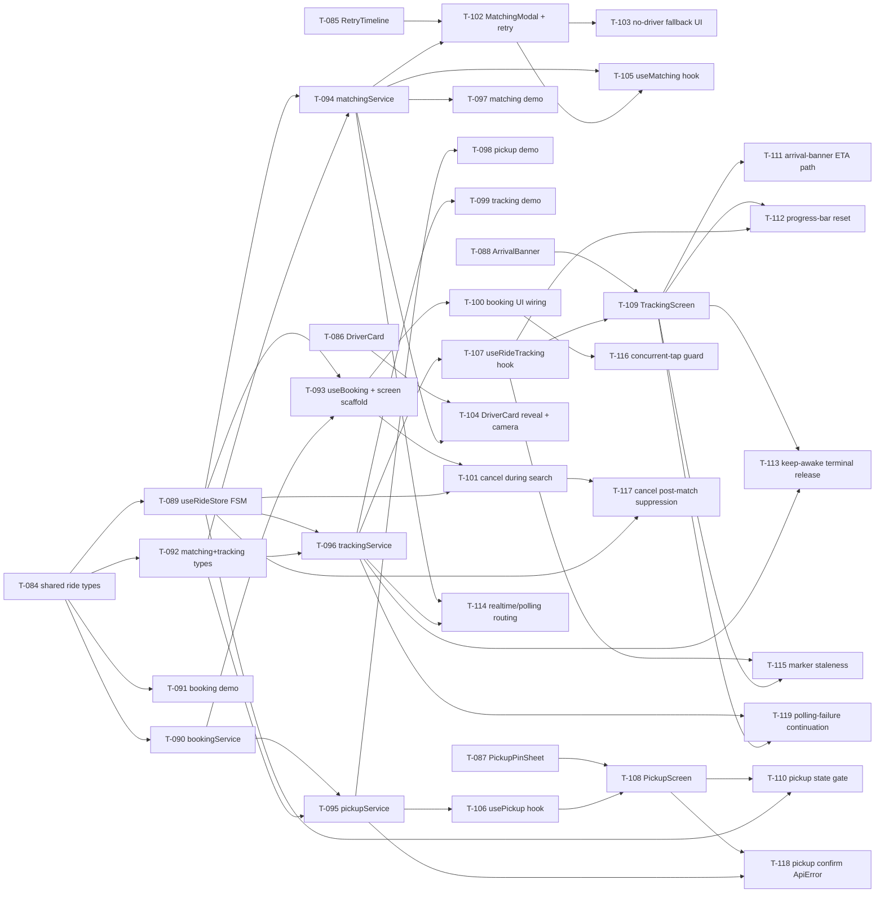

# Build Site — Glidey Phase 2 Booking Flow

End-to-end rider journey: fare estimate → ride creation → driver matching (3-attempt retry + no-driver fallback) → pickup pin selection → live ride tracking.

## Summary

| Metric | Value |
|---|---|
| Total tasks | 36 (T-084 through T-119) |
| Tiers | 5 (Tier 0 through Tier 4) |
| Cavekit domains | 4 |
| Source requirements | 22 |
| Acceptance criteria covered | 119 / 119 (100%) |
| GAPs | 0 |
| Phase | 2 (Phase 1 completed at T-083) |

## Source Kits

- `cavekit-ride-booking.md`: R1, R2, R3, R4, R5
- `cavekit-driver-matching.md`: R1, R2, R3, R4, R5, R6
- `cavekit-pickup-selection.md`: R1, R2, R3, R4, R5
- `cavekit-ride-tracking.md`: R1, R2, R3, R4, R5, R6

---

## Tier 0 — No Dependencies (Start in Parallel)

Pure scaffolding: shared types and pure-presentation UI components. All five of these tasks can execute concurrently.

| Task | Title | Cavekit | Requirement | Effort |
|---|---|---|---|---|
| T-084 | Define `RideState` union + `FareEstimateResponse` + shared ride types in `@rentascooter/shared` | ride-booking, driver-matching | ride-booking/R5, driver-matching/R1 | S |
| T-085 | Build pure `RetryTimeline` component in `@rentascooter/ui` (three stages visible simultaneously) | driver-matching | driver-matching/R2, R5 | M |
| T-086 | Build pure `DriverCard` component in `@rentascooter/ui` (bottom-sheet layout, deterministic fallback avatar) | driver-matching | driver-matching/R4, R5 | M |
| T-087 | Build pure `PickupPinSheet` component in `@rentascooter/ui` (draggable pin + label slot) | pickup-selection | pickup-selection/R1, R5 | M |
| T-088 | Build pure `ArrivalBanner` component (with `ProgressBar` subcomponent) in `@rentascooter/ui` | ride-tracking | ride-tracking/R2, R3, R6 | M |

---

## Tier 1 — Depends on Shared Types (T-084)

Core state and service foundations. Once T-084 lands, these run in parallel.

| Task | Title | Cavekit | Requirement | blockedBy | Effort |
|---|---|---|---|---|---|
| T-089 | Implement `useRideStore` Zustand FSM with transition guard + invalid-transition logging | driver-matching | driver-matching/R1 | T-084 | M |
| T-090 | Implement `bookingService` — `estimateFare`, `createRide`, `cancelRide` + `ApiError` plumbing via shared API client | ride-booking | ride-booking/R1, R2, R3, R5 | T-084 | M |
| T-091 | Implement booking-service demo mode — mock fare amount, mock ride object, mock cancel (no HTTP) | ride-booking | ride-booking/R4 | T-084 | S |
| T-092 | Define `RideMatching` + `TrackingPosition` payload types and `GeoPoint` reuse guard in `@rentascooter/shared` | pickup-selection, ride-tracking | pickup-selection/R5, ride-tracking/R6 | T-084 | S |

---

## Tier 2 — Depends on Store + Services

Service layer that wires realtime transport, polling fallback, reverse geocoding, and keep-awake.

| Task | Title | Cavekit | Requirement | blockedBy | Effort |
|---|---|---|---|---|---|
| T-093 | Implement `useBooking` hook (fare-estimate loading/ready/error state, create action, cancel action) + thin `BookingScreen` scaffold | ride-booking | ride-booking/R5 | T-089, T-090 | M |
| T-094 | Implement `matchingService` — realtime subscription lifecycle, 5s polling fallback, reconnection tear-down | driver-matching | driver-matching/R1, R5 | T-089, T-092 | L |
| T-095 | Implement `pickupService` — reverse geocoding call + `confirmPickup` transmit (single POST) | pickup-selection | pickup-selection/R2, R4 | T-090, T-092 | M |
| T-096 | Implement `trackingService` — realtime position subscription, 5s polling fallback, `expo-keep-awake` lifecycle | ride-tracking | ride-tracking/R1, R4, R5, R6 | T-089, T-092 | L |
| T-097 | Implement `matchingService` demo mode — deterministic delay to `matched`, driver fixture, no HTTP/WS | driver-matching | driver-matching/R6 | T-094 | S |
| T-098 | Implement `pickupService` demo path — bypass transmit, advance FSM locally | pickup-selection | pickup-selection/R4 | T-095 | S |
| T-099 | Implement `trackingService` demo path — scripted position stream, scripted ETA decrement | ride-tracking | ride-tracking/R1, R2 | T-096 | S |

---

## Tier 3 — Depends on Services + Hook Scaffolds

UI integration layer: screens gain behavior, modals wire timeline and fallback, hooks expose state.

| Task | Title | Cavekit | Requirement | blockedBy | Effort |
|---|---|---|---|---|---|
| T-100 | Wire booking UI — fare display (XOF whole-number), Book Now enable/disable, error state, destination-change clear, concurrent-tap guard | ride-booking | ride-booking/R1, R2 | T-093 | M |
| T-101 | Wire cancel-during-search affordance on booking surface (pending/searching only; hidden post-match) | ride-booking | ride-booking/R3 | T-093, T-089 | S |
| T-102 | Build `MatchingModal` — 3-attempt timeout loop (30–90s), `RetryTimeline` wiring, halt on match/cancel | driver-matching | driver-matching/R2 | T-085, T-094 | M |
| T-103 | Build no-driver fallback UI layer — "No drivers nearby" copy, passive animated indicator, cancel affordance retained, late-match auto-advance | driver-matching | driver-matching/R3 | T-102 | M |
| T-104 | Wire `DriverCard` reveal on `matched` transition — bottom-sheet, map camera re-center, state-conditional render guard | driver-matching | driver-matching/R4 | T-086, T-094 | M |
| T-105 | Implement `useMatching` hook — expose `activeAttemptIndex`, `inFallback`, `matchedDriver` | driver-matching | driver-matching/R5 | T-094, T-102 | S |
| T-106 | Implement `usePickup` hook — initial-GPS geocode, drag-end geocode state, onboarding tooltip persistence via AsyncStorage | pickup-selection | pickup-selection/R2, R3, R5 | T-095 | M |
| T-107 | Implement `useRideTracking` hook — exposes `driverPosition`, `currentEta`, `stale` flag; derives progress ratio | ride-tracking | ride-tracking/R1, R3, R6 | T-096 | M |

---

## Tier 4 — Screen Composition

Final composition: full screens wired to hooks, design-compliant layouts.

| Task | Title | Cavekit | Requirement | blockedBy | Effort |
|---|---|---|---|---|---|
| T-108 | Compose `PickupScreen` — `PickupPinSheet`, geocoded label with loading/fallback states, first-use tooltip, `Confirm` button | pickup-selection | pickup-selection/R1, R2, R3, R4, R5 | T-087, T-106 | M |
| T-109 | Compose `TrackingScreen` — driver marker with interpolated animation, `ArrivalBanner` in `pickup_en_route`, stale indicator, keep-awake engaged | ride-tracking | ride-tracking/R1, R2, R3, R4, R6 | T-088, T-107 | L |
| T-110 | Gate pickup map visibility to `matched` state only (screen guard + navigation wiring) | pickup-selection | pickup-selection/R1 | T-108, T-089 | S |
| T-111 | Integrate arrival-banner ETA-update path (incremental re-render, no full reload; survives pan/zoom) | ride-tracking | ride-tracking/R2 | T-109 | S |
| T-112 | Integrate progress-bar reset logic in tracking screen (remaining ETA >20% increase resets `originalEta`) | ride-tracking | ride-tracking/R3 | T-109, T-107 | S |
| T-113 | Integrate keep-awake terminal-release on arrival / cancel / failed; verify idempotent release | ride-tracking | ride-tracking/R4 | T-109, T-096 | S |
| T-114 | Integrate realtime-connected vs disconnected transport routing (suppress polling while connected; restart within 5s on disconnect) | driver-matching, ride-tracking | driver-matching/R1, ride-tracking/R1, R5 | T-094, T-096 | M |
| T-115 | Integrate driver-marker staleness detector (flag set when no update beyond expected cadence) | ride-tracking | ride-tracking/R1 | T-107, T-109 | S |
| T-116 | Integrate ride-creation concurrent-tap guard (in-flight ref on Book Now) | ride-booking | ride-booking/R2 | T-100 | S |
| T-117 | Integrate cancellation post-match suppression (cancel control hidden once `matched`) | ride-booking | ride-booking/R3 | T-101, T-089 | S |
| T-118 | Integrate ApiError surface for pickup confirm failure — remain on pickup surface, allow retry | pickup-selection | pickup-selection/R4 | T-108, T-095 | S |
| T-119 | Integrate polling-failure continuation — surface `ApiError` but schedule next interval; no tracking teardown on single failure | ride-tracking | ride-tracking/R5 | T-096, T-109 | S |

---

## Coverage Matrix

Every acceptance criterion from every source requirement, with its covering task(s). All 119 criteria are COVERED.

### cavekit-ride-booking.md — R1 Fare estimate (6 ACs)

| AC | Description | Covered by |
|---|---|---|
| R1.AC1 | Book Now disabled until estimate resolves | T-100 |
| R1.AC2 | Fare XOF whole-number formatting | T-100 |
| R1.AC3 | Request carries `distanceM` + `durationS` | T-090, T-100 |
| R1.AC4 | Response exposes typed `fareEstimate` numeric (XOF) | T-084, T-090 |
| R1.AC5 | On failure: error state + Book Now disabled | T-100, T-093 |
| R1.AC6 | Destination change clears previous estimate | T-100, T-093 |

### cavekit-ride-booking.md — R2 Ride creation request (6 ACs)

| AC | Description | Covered by |
|---|---|---|
| R2.AC1 | Book Now dispatches exactly one create request | T-100, T-116 |
| R2.AC2 | Body: pickup lat/lng + destination lat/lng/address + `distanceM` + `durationS` | T-090, T-100 |
| R2.AC3 | Response exposes typed ride with `id` | T-084, T-090 |
| R2.AC4 | Authenticated via shared API client | T-090 |
| R2.AC5 | Backend failure → `ApiError`; UI returns to pre-booking | T-090, T-100 |
| R2.AC6 | Concurrent taps ≤ 1 in-flight request | T-116 |

### cavekit-ride-booking.md — R3 Cancel during search (6 ACs)

| AC | Description | Covered by |
|---|---|---|
| R3.AC1 | Cancel visible/interactive in pending/searching | T-101 |
| R3.AC2 | Cancel dispatches request referencing ride id | T-090, T-101 |
| R3.AC3 | On success: UI returns to pre-booking | T-101, T-093 |
| R3.AC4 | Authenticated via shared API client | T-090 |
| R3.AC5 | Cancellation failure → `ApiError`; ride id retained | T-090, T-101 |
| R3.AC6 | Cancel not available once matched | T-117 |

### cavekit-ride-booking.md — R4 Demo mode (4 ACs)

| AC | Description | Covered by |
|---|---|---|
| R4.AC1 | Demo fare: mock positive XOF, no HTTP | T-091 |
| R4.AC2 | Demo create: mock ride with non-empty id, no HTTP | T-091 |
| R4.AC3 | Demo cancel: no HTTP, returns to pre-booking | T-091 |
| R4.AC4 | Demo values satisfy real response types | T-084, T-091 |

### cavekit-ride-booking.md — R5 Thin screen architecture (6 ACs)

| AC | Description | Covered by |
|---|---|---|
| R5.AC1 | Booking screen: layout/composition only | T-093 |
| R5.AC2 | Booking hook exposes fare state/create/cancel | T-093 |
| R5.AC3 | Booking service exposes three methods | T-090 |
| R5.AC4 | `FareEstimateResponse` in shared types package | T-084 |
| R5.AC5 | Ride FSM state identifiers in shared types | T-084 |
| R5.AC6 | All failures via shared `ApiError` | T-090 |

### cavekit-driver-matching.md — R1 Ride state machine (7 ACs)

| AC | Description | Covered by |
|---|---|---|
| R1.AC1 | Store exposes FSM: idle/searching/matched/pickup_en_route/completed/cancelled/failed | T-089 |
| R1.AC2 | State identifiers in shared types package | T-084 |
| R1.AC3 | Realtime connected: transitions from events, no polling | T-094, T-114 |
| R1.AC4 | Realtime disconnected: poll every 5s until reconnect | T-094, T-114 |
| R1.AC5 | Polling stops before next interval on reconnect | T-094, T-114 |
| R1.AC6 | Invalid transition rejected + logged | T-089 |
| R1.AC7 | Consumers observe state only through store | T-089, T-105 |

### cavekit-driver-matching.md — R2 Three-attempt retry + timeline (6 ACs)

| AC | Description | Covered by |
|---|---|---|
| R2.AC1 | ≤ 3 attempts before fallback | T-102 |
| R2.AC2 | Attempt timeout 30–90s; next auto-starts on timeout | T-102 |
| R2.AC3 | All three stages visible simultaneously (wide timeline) | T-085, T-102 |
| R2.AC4 | Active stage visually distinguished | T-085 |
| R2.AC5 | Driver match halts loop immediately | T-102 |
| R2.AC6 | User cancel halts loop immediately | T-102 |

### cavekit-driver-matching.md — R3 No-driver fallback (5 ACs)

| AC | Description | Covered by |
|---|---|---|
| R3.AC1 | "No drivers nearby — we're working hard to find you a match" copy | T-103 |
| R3.AC2 | Passive animated indicator (no action-implying spinner) | T-103 |
| R3.AC3 | Store remains in `searching`; UI-layer fallback only | T-103, T-089 |
| R3.AC4 | Late driver accept → matched, card auto-presented | T-103, T-104 |
| R3.AC5 | Cancel affordance remains accessible during fallback | T-103 |

### cavekit-driver-matching.md — R4 Driver card on match (6 ACs)

| AC | Description | Covered by |
|---|---|---|
| R4.AC1 | On `matched` transition: bottom-sheet driver card | T-104 |
| R4.AC2 | Card: name, vehiclePlate, vehicleType, rating, completed-ride count | T-086 |
| R4.AC3 | Profile photo or deterministic fallback avatar | T-086 |
| R4.AC4 | `vehicleType` rendered verbatim | T-086 |
| R4.AC5 | Map re-centers on driver lat/lng at match moment | T-104 |
| R4.AC6 | Card not presented outside matched/pickup_en_route | T-104 |

### cavekit-driver-matching.md — R5 Reusable components + hook/service split (5 ACs)

| AC | Description | Covered by |
|---|---|---|
| R5.AC1 | `DriverCard` exported from shared UI layer | T-086 |
| R5.AC2 | `RetryTimeline` exported from shared UI layer | T-085 |
| R5.AC3 | Matching hook: attempt index, fallback flag, matched driver | T-105 |
| R5.AC4 | Matching service: subscription lifecycle + polling fallback | T-094 |
| R5.AC5 | No screen contains inline subscription/timers/bookkeeping | T-102, T-105 |

### cavekit-driver-matching.md — R6 Demo mode (5 ACs)

| AC | Description | Covered by |
|---|---|---|
| R6.AC1 | Demo: transitions to matched after short deterministic delay | T-097 |
| R6.AC2 | Demo driver fixture satisfies full driver-card shape | T-097 |
| R6.AC3 | No outgoing HTTP in demo | T-097 |
| R6.AC4 | No realtime subscription in demo | T-097 |
| R6.AC5 | Retry timeline renders in demo for visual parity | T-097, T-102 |

### cavekit-pickup-selection.md — R1 Pickup pin map (5 ACs)

| AC | Description | Covered by |
|---|---|---|
| R1.AC1 | Pickup map only while `matched` | T-110 |
| R1.AC2 | Pin initially at user's GPS lat/lng | T-108, T-106 |
| R1.AC3 | Pin draggable anywhere on visible map | T-087, T-108 |
| R1.AC4 | Pin visually follows gesture without lag | T-087 |
| R1.AC5 | Map occupies full/near-full screen | T-108 |

### cavekit-pickup-selection.md — R2 Reverse geocoding on drag-end (5 ACs)

| AC | Description | Covered by |
|---|---|---|
| R2.AC1 | Lookup on drag-end only (not during drag) | T-106, T-095 |
| R2.AC2 | Resolved address displayed in label near pin | T-108 |
| R2.AC3 | Loading state during in-flight lookup (no stale text) | T-106, T-108 |
| R2.AC4 | Failed lookup: fallback label (coord string or "address unavailable") | T-106, T-108 |
| R2.AC5 | Initial render: label shows geocoded address for initial GPS | T-106 |

### cavekit-pickup-selection.md — R3 First-use onboarding tooltip (5 ACs)

| AC | Description | Covered by |
|---|---|---|
| R3.AC1 | First arrival: tooltip "Drag the pin to your exact pickup spot" | T-108, T-106 |
| R3.AC2 | Dismisses on first user interaction | T-106 |
| R3.AC3 | Dismissal persisted across relaunches (AsyncStorage) | T-106 |
| R3.AC4 | Not shown on subsequent arrivals | T-106 |
| R3.AC5 | Fresh install / state clear restores first-use | T-106 |

### cavekit-pickup-selection.md — R4 Confirm and transmit pickup (6 ACs)

| AC | Description | Covered by |
|---|---|---|
| R4.AC1 | Coords NOT transmitted before Confirm tap | T-108, T-095 |
| R4.AC2 | Confirm dispatches exactly one request: ride id + pickup lat/lng | T-095, T-108 |
| R4.AC3 | Authenticated via shared API client | T-095 |
| R4.AC4 | Backend failure: `ApiError`, stays on pickup, retry allowed | T-118 |
| R4.AC5 | On success: FSM advances to `pickup_en_route` | T-095, T-098 |
| R4.AC6 | No pre-Confirm transmission to ride backend (geocoding allowed) | T-095, T-108 |

### cavekit-pickup-selection.md — R5 Reusable component + shared GeoPoint (5 ACs)

| AC | Description | Covered by |
|---|---|---|
| R5.AC1 | `PickupPinSheet` exported from shared UI layer | T-087 |
| R5.AC2 | Component exposes pin position + drag-end event | T-087 |
| R5.AC3 | Pickup coords conform to existing `GeoPoint` | T-092 |
| R5.AC4 | No parallel lat/lng shape defined | T-092 |
| R5.AC5 | Screen layout/composition only; logic in hook + service | T-108, T-106, T-095 |

### cavekit-ride-tracking.md — R1 Live driver position (5 ACs)

| AC | Description | Covered by |
|---|---|---|
| R1.AC1 | Driver marker updated every 3–5 seconds | T-096 |
| R1.AC2 | Realtime connected: updates from push, not polling | T-096, T-114 |
| R1.AC3 | Smooth interpolated animation between positions | T-109 |
| R1.AC4 | Realtime disconnected: polling fallback supplies updates | T-096, T-114 |
| R1.AC5 | No update beyond expected cadence: UI indicates stale | T-115, T-107 |

### cavekit-ride-tracking.md — R2 Arrival time banner (5 ACs)

| AC | Description | Covered by |
|---|---|---|
| R2.AC1 | Banner rendered at bottom of map in `pickup_en_route` | T-109 |
| R2.AC2 | Displays driver name/label + ETA in minutes | T-088, T-109 |
| R2.AC3 | Not rendered in any other state | T-109 |
| R2.AC4 | ETA updates without full screen reload | T-111 |
| R2.AC5 | Visible during map gestures (pan, zoom) | T-109, T-111 |

### cavekit-ride-tracking.md — R3 Progress bar (5 ACs)

| AC | Description | Covered by |
|---|---|---|
| R3.AC1 | Progress advances as remaining ETA decreases | T-088, T-107 |
| R3.AC2 | Formula `(originalEta - remainingEta)/originalEta`; originalEta captured on tracking entry | T-107 |
| R3.AC3 | Remaining ETA +20% above last observed: bar resets, new originalEta | T-112 |
| R3.AC4 | Progress clamped to [0, 1] | T-088, T-107 |
| R3.AC5 | On arrival (ETA ≈ 0): fully filled | T-088, T-107 |

### cavekit-ride-tracking.md — R4 Screen keep-awake (5 ACs)

| AC | Description | Covered by |
|---|---|---|
| R4.AC1 | Screen does not sleep/dim during active tracking | T-096, T-109 |
| R4.AC2 | Keep-awake engaged no later than tracking phase transition | T-096, T-109 |
| R4.AC3 | Released on every terminal exit: arrival, cancel, failed | T-113 |
| R4.AC4 | Not engaged during idle/searching/pre-tracking | T-096 |
| R4.AC5 | Release is idempotent | T-113, T-096 |

### cavekit-ride-tracking.md — R5 Polling fallback transport (6 ACs)

| AC | Description | Covered by |
|---|---|---|
| R5.AC1 | Realtime disconnect triggers polling within 5s | T-096, T-114 |
| R5.AC2 | Polling every 5s while disconnected | T-096 |
| R5.AC3 | Polling requests authenticated via shared API client | T-096 |
| R5.AC4 | On reconnection: polling stops before next interval | T-114, T-096 |
| R5.AC5 | Polling failure → `ApiError` but tracking continues | T-119 |
| R5.AC6 | Polling not dispatched while realtime connected | T-114, T-096 |

### cavekit-ride-tracking.md — R6 Reusable components + hook/service split (5 ACs)

| AC | Description | Covered by |
|---|---|---|
| R6.AC1 | `ArrivalBanner` (with progress bar) exported from shared UI layer | T-088 |
| R6.AC2 | Tracking hook: `driverPosition`, `currentEta`, `stale` | T-107 |
| R6.AC3 | Tracking service: subscription + polling + keep-awake lifecycle | T-096 |
| R6.AC4 | Tracking screen: layout/composition only | T-109 |
| R6.AC5 | Failures surface through `ApiError` | T-096, T-119 |

**Coverage total: 119 / 119 ACs covered. 0 GAPs.**

---

## Dependency Graph

---

## Parallelization Notes

- **Tier 0 wave (5 tasks):** T-084, T-085, T-086, T-087, T-088 are fully independent. Launch all five in parallel.
- **Tier 1 wave (4 tasks):** Once T-084 lands, T-089/T-090/T-091/T-092 parallelize.
- **Tier 2 wave:** T-094/T-095/T-096 are independent services — parallelize. Demo-mode tasks (T-097/T-098/T-099) each attach to their parent service and can run concurrently with each other.
- **Tier 3 wave:** T-100, T-102 → T-103, T-104, T-106, T-107 all parallelize once their parent services are ready.
- **Tier 4 integration:** T-108 and T-109 are the two big screen composition jobs and are independent of each other.

---

## Architect Report

### Framework Posture
The target stack is Expo 54 / React Native 0.81 / React 19 with TypeScript strict, Zustand for client state, React Query for server state, Mapbox for maps, and the existing shared API client from Phase 1 (`impl-api-client.md`). Phase 2 layers behavior — a ride FSM and realtime transport — on top of that foundation. The five `@rentascooter/*` packages are already wired into Metro and tsconfig paths, so new exports slot in naturally via barrel files.

### Key Architectural Decisions

1. **Ride FSM lives in `@rentascooter/shared` (T-084, T-089).** States (`idle`, `searching`, `matched`, `pickup_en_route`, `completed`, `cancelled`, `failed`) are shared types, and the Zustand store enforces transition legality with an invalid-transition logger. This makes every consumer — booking, matching, pickup, tracking — observe one source of truth.

2. **Hook/service split is strict (all R5 / R6 criteria).** Screens compose layout only. Hooks expose state. Services encapsulate transport (realtime subscription + polling fallback + keep-awake). No screen in this plan contains a subscription setup, timer, or retry counter.

3. **Realtime-first, polling fallback (driver-matching R1, ride-tracking R1/R5).** A single transport-routing task (T-114) ensures polling never runs while realtime is connected and that on disconnect, polling resumes within 5s. This behavior is shared between matching and tracking by design.

4. **No-driver fallback is UI-only (driver-matching R3).** Store remains in `searching`; the fallback is a render-time branch in `MatchingModal`. A late driver accept naturally drives a `matched` transition, which the driver-card reveal (T-104) picks up. No new FSM state needed.

5. **Demo parity is enforced per layer (ride-booking R4, driver-matching R6, pickup/tracking demo tasks).** `EXPO_PUBLIC_USE_DEMO=true` short-circuits each service at the service boundary, never in hooks or screens. Demo fixtures reuse the same TypeScript types as real responses.

6. **`GeoPoint` reuse is explicit (pickup-selection R5, T-092).** No parallel lat/lng shape. Pickup coordinates, driver positions, and tracking positions all use the existing `GeoPoint` from `@rentascooter/shared`.

7. **Progress-bar semantics are protected (ride-tracking R3).** Formula and reset-on-20%-increase logic are pinned in both `useRideTracking` (T-107) and `TrackingScreen` integration (T-112) so the component itself remains pure.

### Risks and Mitigations

- **Realtime transport selection is unspecified.** The kits say "realtime" but not the transport (WebSocket vs Firestore snapshot vs Firebase Realtime DB). T-094 and T-096 both take a transport dependency; the builder should choose one aligned with existing Firebase Functions backend and document in `impl-*`. Risk: P1. Mitigation: flagged in known-issues backlog when created.
- **Keep-awake lifecycle can leak if terminal release isn't idempotent.** T-113 explicitly tests idempotent release across arrival, cancel, failed. `expo-keep-awake` supports `activateKeepAwake`/`deactivateKeepAwake` with tags — use a constant tag to make release safe to call multiple times.
- **Driver staleness detection (T-115) depends on cadence clock.** "Every 3–5 seconds" implies a tolerance; builder should set a threshold (e.g., 2× expected cadence) and gate the stale flag in the hook.
- **Progress bar reset (T-112) is a guard against ETA oscillation.** If the backend reports ETA that jitters ≥20% upward intermittently, the bar will flicker-reset. The kit treats this as correct behavior — a meaningful route change. No mitigation needed, but the builder should log resets for telemetry.
- **Concurrent Book Now taps (T-116).** A React ref-guarded promise is simpler and sufficient; avoid pulling in a mutex library.

### Unknowns for Builders to Resolve

1. **Attempt timeout specifics.** R2.AC2 says 30–90s per attempt. T-102 defaults to the mid-range (e.g., 60s × 3 = 3 minutes) unless product direction specifies otherwise.
2. **"Driver label" fallback in arrival banner (R2.AC2).** If name is absent, use "Your driver" or `vehicleType` — builder's call, document in `impl-*`.
3. **Stale-indicator visual.** Kit says "UI indicates stale" without pinning style. Default to a muted color/icon on the driver marker + banner.

### Validation Plan

Each task carries an implicit test strategy. For this codebase (no test runner currently configured, per project CLAUDE.md), validation is:

- **Type-level:** `yarn tsc --noEmit` passes after each task that touches types (T-084, T-092, all services, all hooks).
- **Lint-level:** `yarn lint` passes after each task.
- **Runtime-level:** Demo-mode bring-up on iOS simulator (`yarn ios` with `EXPO_PUBLIC_USE_DEMO=true`) walks the full flow: booking → matching → pickup → tracking without hitting the network.
- **Contract-level:** For each service, confirm authenticated request shape via network inspector against a dev Firebase project before merging.

### Time Guard Expectations

- 14 tasks sized S (≤ 30 min)
- 18 tasks sized M (30 min – 2 hrs)
- 4 tasks sized L (T-094 matching service, T-096 tracking service, T-109 tracking screen — each is multi-concern and may benefit from splitting during execution if a sub-area exceeds its time guard)

### Phase Transition

Phase 1 closed at T-083. This build site opens T-084 and consumes T-084 through T-119 — exactly 36 tasks. The next build site (if Phase 3 is planned) should start at T-120.
