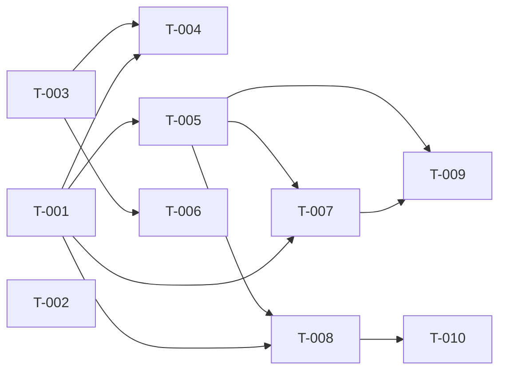

# Build Site — Driver En-Route UX

10 tasks across 4 tiers from 1 kit (cavekit-driver-en-route-ux.md).

---

## Tier 0 — No Dependencies (Start Here)

- **T-001**: Add pickup_en_route state branch to booking sheet (R2) — M
  - Covers R2/1, R2/2, R2/3, R2/4, R2/5
  - Wire sheet controller to programmatically snap to mini on state entry; ensure no drag path or kit-internal programmatic path dismisses the sheet; allow drag between mini/peek/full snap levels; reuse the matched-state sheet mode enum value (no new enum introduced).
  - **Test Strategy:** Unit test that entry into pickup_en_route invokes snapTo(mini) exactly once; drag-dismiss gesture simulation asserts sheet remains mounted; enum audit confirms no new sheetMode value added.

- **T-002**: Demo-mode trigger — auto-fire pickup_en_route ~3s after hasArrived (R6) — S
  - Covers R6/1, R6/2, R6/3
  - When demo mode is enabled and the matched-arrived sub-state has latched, schedule a ~3s timer that transitions rideState to pickup_en_route. When demo mode is disabled, no automatic transition. Document that WebSocket/server-originated trigger is explicitly a GAP in this kit.
  - **Test Strategy:** Jest fake timers assert transition fires at ~3s with demo on; assert no transition fires with demo off; code comment + GAP note verified via grep.

- **T-003**: Render en-route route polyline on map (R1 criteria 1–3, 7) — M
  - Covers R1/1, R1/2, R1/3, R1/7
  - While pickup_en_route, render polyline starting at user pickup position and ending at booking destination. Reuse already-available route geometry from booking/route-directions store — do NOT issue a new network request on state entry. Ensure conditional render gate so polyline does not appear outside pickup_en_route.
  - **Test Strategy:** Integration test renders MapView in pickup_en_route state, asserts polyline exists with correct coords; network spy asserts zero new route-directions requests; render assertion confirms no polyline in other states.

## Tier 1 — Depends on Tier 0

- **T-004**: Camera bounds-fit on pickup_en_route entry (R1 criteria 4–6) — S
  - Covers R1/4, R1/5, R1/6
  - **blockedBy:** T-001, T-003
  - On transition into pickup_en_route, animate map camera to frame both pickup coordinate and destination coordinate. Use animated fit (duration > 0), not instant jump. Guard with an entry-latch ref so the framing runs exactly once per state entry; re-entry (exit + re-enter) must trigger again.
  - **Test Strategy:** Spy on map camera API, assert animated flag true; count invocations — exactly 1 on first entry, 0 on subsequent renders within the same state, 1 on re-entry after exit.

- **T-005**: ETA countdown for pickup_en_route state (R5 all) — M
  - Covers R5/1, R5/2, R5/3, R5/4, R5/5, R5/6, R5/7, R5/8
  - **blockedBy:** T-001
  - Initialise ETA display from `enRouteEtaSeconds` on state entry. Decrement ETA over real time without user interaction. Format: `≥ 60s → "X min"` (integer minutes), `< 60s and > 0 → "Arrivée imminente"`, `= 0 → "Arrivée imminente"` (never negative). Latch arrived condition when ETA reaches 0; subsequent ETA changes must not revert the latch while pickup_en_route. Stop countdown timer when rideState leaves pickup_en_route (cleanup on unmount / state exit).
  - **Test Strategy:** Jest fake-timer tests for each formatting branch; latch test drives ETA to 0 then back to 120 and asserts arrived stays true; cleanup test unmounts and asserts timer disposed.

- **T-006**: Polyline removal when leaving pickup_en_route (R1 criterion 7) — S
  - Covers R1/7 (teardown complement to T-003 render gate)
  - **blockedBy:** T-003
  - On exit from pickup_en_route, ensure the en-route polyline component unmounts cleanly (no orphan overlay left behind). Pair with the render gate from T-003 so both entry and exit paths leave the map in the correct state.
  - **Test Strategy:** Transition test: enter pickup_en_route (polyline present) → exit to next state (polyline absent); snapshot map overlays pre/post exit.

## Tier 2 — Depends on Tier 1

- **T-007**: Mini strip — avatar, name, ETA display (R3 criteria 1–3, 9, 10) — M
  - Covers R3/1, R3/2, R3/3, R3/9, R3/10
  - **blockedBy:** T-001, T-005
  - Render driver avatar (initials fallback when no image), driver name, live ETA value formatted per R5. Explicitly do NOT render booking destination text in the mini strip while pickup_en_route. Tapping the mini strip expands sheet to peek snap level (wire to sheet controller from T-001).
  - **Design Ref:** DESIGN.md driver strip tokens; reuse matched-state avatar + name primitives.
  - **Test Strategy:** Snapshot of mini strip with and without avatar URL asserts initials fallback; grep assertion for absence of destination text; fireEvent.press on strip asserts snapTo(peek) called.

- **T-008**: Peek/full — driver card + large ETA block (R4 criteria 1–5, 14) — M
  - Covers R4/1, R4/2, R4/3, R4/4, R4/5, R4/14
  - **blockedBy:** T-001, T-005
  - Render driver name, vehicle type, vehicle plate, driver star rating, and large-format live ETA block (same format source as R5). All user-visible strings in French.
  - **Design Ref:** DESIGN.md driver card tokens; large ETA block typography.
  - **Test Strategy:** Render test asserts each field present with correct data-testid; i18n audit asserts all strings come from the French bundle (no raw English).

## Tier 3 — Depends on Tier 2

- **T-009**: Mini strip — progress bar with map-pin anchor (R3 criteria 4–8) — M
  - Covers R3/4, R3/5, R3/6, R3/7, R3/8
  - **blockedBy:** T-007, T-005
  - Render horizontal progress bar in mini strip. At state entry, filled portion = 0%. While ETA decreasing and not arrived, progress fills linearly with elapsed time and is capped at 95%. Progress reaches 100% only when the arrived condition (from R5 latch, T-005) is true. Render a map-pin icon at the end of the progress bar as the visual anchor.
  - **Design Ref:** DESIGN.md progress bar + anchor icon.
  - **Test Strategy:** Fake-timer tests drive elapsed time and assert width monotonically increases without exceeding 95% pre-arrival; once arrived latch flips true, asserts 100%; snapshot includes pin icon at bar tail.

- **T-010**: Peek/full — cancel control with two-step fee warning (R4 criteria 6–13) — M
  - Covers R4/6, R4/7, R4/8, R4/9, R4/10, R4/11, R4/12, R4/13
  - **blockedBy:** T-008
  - Render cancel control in peek/full. On press before arrived, present a warning step showing exactly the string `"Votre conducteur est en route — des frais d'annulation peuvent s'appliquer."` with no numeric fee amount and no currency symbol. On warning confirmation, present the standard cancel confirmation step. Only commit the cancel action after the user confirms the second (standard) step. Dismissing either step without confirming must NOT commit the cancel.
  - **Design Ref:** DESIGN.md confirmation modal tokens; warning vs standard step styling.
  - **Test Strategy:** Integration test walks: press cancel → assert warning string literal → dismiss → assert cancel not committed; press cancel → confirm warning → dismiss standard → assert not committed; press cancel → confirm warning → confirm standard → assert committed exactly once. Regex assertion `/\d|€|FCFA|XOF/` must NOT match the warning body.

---

## Summary

- **Total tasks:** 10
- **Tiers:** 4 (T0: 3 tasks, T1: 3 tasks, T2: 2 tasks, T3: 2 tasks)
- **Effort mix:** 6 × M, 4 × S
- **Kit coverage:** cavekit-driver-en-route-ux.md → R1 (7), R2 (5), R3 (10), R4 (14), R5 (8), R6 (3) = 47 criteria
- **Parallelizable in Tier 0:** T-001, T-002, T-003 (all independent — 3-way fan-out)
- **Known GAP carried forward:** R6/3 — WebSocket/server-originated trigger not defined, documented in T-002

---

## Coverage Matrix

All 47 acceptance criteria mapped. Status: COVERED.

| Criterion | Summary | Task(s) | Status |
|---|---|---|---|
| R1/1 | Polyline start at user pickup | T-003 | COVERED |
| R1/2 | Polyline end at destination | T-003 | COVERED |
| R1/3 | No new network request on entry | T-003 | COVERED |
| R1/4 | Camera frames pickup + destination | T-004 | COVERED |
| R1/5 | Camera move animated | T-004 | COVERED |
| R1/6 | Framing exactly once per entry | T-004 | COVERED |
| R1/7 | Polyline not rendered outside state | T-003, T-006 | COVERED |
| R2/1 | Sheet snaps to mini on entry | T-001 | COVERED |
| R2/2 | No drag dismisses sheet | T-001 | COVERED |
| R2/3 | No kit-internal programmatic dismiss | T-001 | COVERED |
| R2/4 | Drag between mini/peek/full works | T-001 | COVERED |
| R2/5 | No new sheetMode enum value | T-001 | COVERED |
| R3/1 | Mini: avatar with initials fallback | T-007 | COVERED |
| R3/2 | Mini: driver name | T-007 | COVERED |
| R3/3 | Mini: live ETA per R5 format | T-007 | COVERED |
| R3/4 | Mini: horizontal progress bar | T-009 | COVERED |
| R3/5 | Progress 0% at entry | T-009 | COVERED |
| R3/6 | Progress increases linearly, caps at 95% | T-009 | COVERED |
| R3/7 | Progress 100% only when arrived latched | T-009 | COVERED |
| R3/8 | Map-pin icon at end of bar | T-009 | COVERED |
| R3/9 | Destination text NOT in mini | T-007 | COVERED |
| R3/10 | Tap mini expands to peek | T-007 | COVERED |
| R4/1 | Peek/full: driver name | T-008 | COVERED |
| R4/2 | Peek/full: vehicle type | T-008 | COVERED |
| R4/3 | Peek/full: vehicle plate | T-008 | COVERED |
| R4/4 | Peek/full: star rating | T-008 | COVERED |
| R4/5 | Peek/full: large ETA block | T-008 | COVERED |
| R4/6 | Peek/full: cancel control | T-010 | COVERED |
| R4/7 | Cancel before arrived → warning step | T-010 | COVERED |
| R4/8 | Warning exact French string | T-010 | COVERED |
| R4/9 | Warning has no numeric fee/currency | T-010 | COVERED |
| R4/10 | Standard confirmation follows warning | T-010 | COVERED |
| R4/11 | Commit only after standard confirm | T-010 | COVERED |
| R4/12 | Dismiss warning → no commit | T-010 | COVERED |
| R4/13 | Dismiss standard → no commit | T-010 | COVERED |
| R4/14 | All strings in French | T-008 | COVERED |
| R5/1 | ETA init from enRouteEtaSeconds | T-005 | COVERED |
| R5/2 | ETA decreases over real time | T-005 | COVERED |
| R5/3 | ≥60s → "X min" | T-005 | COVERED |
| R5/4 | <60s & >0 → "Arrivée imminente" | T-005 | COVERED |
| R5/5 | =0 → "Arrivée imminente", no negatives | T-005 | COVERED |
| R5/6 | Arrived latches at ETA 0 | T-005 | COVERED |
| R5/7 | Latch not reverted by later ETA changes | T-005 | COVERED |
| R5/8 | Countdown stops when state leaves | T-005 | COVERED |
| R6/1 | Demo + arrived → ~3s transition | T-002 | COVERED |
| R6/2 | Demo off → no auto transition | T-002 | COVERED |
| R6/3 | WS/server trigger marked GAP | T-002 | COVERED |

**Coverage total:** 47 / 47 criteria COVERED. Zero gaps.

---

## Dependency Graph

Notes on the graph:
- T-002 has no dependencies and no dependents inside this build site — it is a standalone trigger task and can ship in parallel with any tier.
- T-001, T-003 are the two infrastructure fan-out points (sheet controller + polyline render gate).
- T-005 (ETA countdown) feeds four downstream tasks (T-007, T-008, T-009 directly, and T-010 indirectly via T-008) — prioritize it after T-001 lands.

---

## Architect Report

### Scope
One kit (`cavekit-driver-en-route-ux.md`) decomposed into 10 tasks. 47 acceptance criteria — all mapped to concrete tasks with explicit test strategies. No orphan tasks, no uncovered criteria, no cycles in the dependency graph.

### Critical Path
The longest chain is T-001 → T-008 → T-010 (three tiers). Plan for this to drive the schedule. T-009 is shorter (T-007 → T-009) but blocked additionally on T-005, so in practice both chains converge on the ETA/sheet foundation tasks.

### Parallelization Opportunities
- Tier 0 (T-001, T-002, T-003) is fully parallel — three agents can start simultaneously.
- At Tier 1, T-004 / T-005 / T-006 are independent of each other and can run in parallel once their upstream tasks finish.
- At Tier 2, T-007 and T-008 are independent and parallelizable.
- T-002 (demo trigger) is an isolated leaf and can ship anytime.

### Known Risks / GAPs
1. **R6/3 GAP** — WebSocket/server-originated trigger for entering pickup_en_route is explicitly undefined in the kit. T-002 documents this inline. A follow-up kit or production trigger design is needed before this domain is production-ready; demo mode is the only entry path currently specified.
2. **R1/3 (no new network request)** — T-003 assumes the already-available route geometry is reachable from the en-route feature module. If route-directions store is not exposed where T-003 needs it, a small prerequisite refactor may surface. Flagged as a potential [CONDITIONAL] scope expansion during T-003 execution.
3. **R5 latch semantics** — T-005 carries the arrived-latch logic that R3/7 (progress bar 100%) depends on. Any bug in the latch affects the progress bar correctness. Recommend landing T-005 with strong unit coverage before T-009 starts.
4. **R4/8 string literal brittleness** — The warning string is an exact-match requirement. Source it from the French i18n bundle as a single constant and assert both the bundle entry and render output in tests to avoid drift.

### Suggested Agent Assignment
- **ck:make (map/sheet specialist)** → T-001, T-003, T-004, T-006
- **ck:make (state/timer specialist)** → T-002, T-005
- **ck:make (UI specialist)** → T-007, T-008, T-009, T-010

### Validation Checklist (pre-execution)
- [x] Every kit requirement has ≥1 task
- [x] Every acceptance criterion (47/47) has ≥1 task
- [x] No orphan tasks
- [x] No cycles in dependency graph
- [x] All tasks have test strategies
- [x] All tasks have effort sizing (S/M)
- [x] All tasks have explicit blockedBy declarations
- [x] GAP carried forward explicitly (R6/3)
