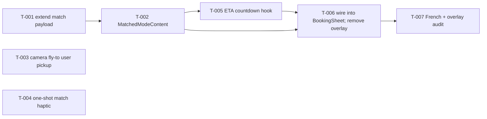

# Build Site: Driver Reveal UI

Single-kit build site covering `cavekit-driver-reveal-ui.md` (R1–R5). Replaces the
existing `DriverReveal` bottom-card pattern with in-sheet matched-state content that
lives inside the current `components/BookingSheet/BookingSheet.tsx` instance.

Scope focus: matched-state content inside the booking modal sheet (R1), live ETA
countdown (R2), map camera fly-to user pickup on match (R3), one-shot haptic on
match entry (R4), French strings on this surface (R5). Push notifications and
post-reveal tracking are explicitly out of scope per the kit.

Stack anchors the builders will touch:
- `components/BookingSheet/BookingSheet.tsx` — unified sheet; currently renders
  `<DriverReveal visible={isMatched} />` as a separate bottom-card overlay at the
  end of its JSX. This must be removed in favour of an in-sheet `MatchedModeContent`
  branch rendered inside the existing `showBookingSurface` `<Animated.View>` when
  `rideState === 'matched'`.
- `components/DriverReveal/DriverReveal.tsx` — existing overlay; the content
  pattern (avatar + name + vehicleType + rating) is reused in-place via an
  extracted `MatchedModeContent` component. The wrapping `<Animated.View>` overlay
  is deleted.
- `packages/shared/src/stores/rideStore.ts` — `transition('matched', { driver })`
  already carries the `MatchedDriver` payload. ETA is NOT on `MatchedDriver` today
  (`etaSeconds` lives on `TrackingPositionUpdate` per `types/index.ts:405`) —
  this build site adds an initial ETA to the match payload so the countdown has a
  starting value at reveal time.
- `packages/ui/src/components/DriverCard/DriverCard.tsx` — displays name,
  vehicleType, rating, avatar with background fallback color. The kit requires an
  initials text fallback specifically when no image is available or fails to load;
  the existing `Avatar` already accepts `name` so initials generation can be
  centralized there. Review + patch if needed.
- `app/(main)/index.tsx` — holds `cameraRef`, `animateToLocation`, and `Haptics`
  usage (lines 97, 108, 182, 264, 284, 306). Map-fly-to on match is wired here via
  a `useEffect` watching `rideState`.
- `hooks/useMatching.ts` — single producer of the `'matched'` transition
  (line 67); the build site does not change its contract, only the payload shape
  (adds ETA seconds).

---

## Tier 0 — No Dependencies

| Task | Title | Cavekit | Requirement | Effort |
|------|-------|---------|-------------|--------|
| T-001 | Extend match payload with `initialEtaSeconds` | driver-reveal-ui | R1 (AC 7), R2 (AC 1) | S |
| T-003 | Camera fly-to user pickup on match-entry effect | driver-reveal-ui | R3 (ACs 1, 2, 3, 4) | M |
| T-004 | One-shot haptic on match-entry effect | driver-reveal-ui | R4 (ACs 1, 2, 3) | S |

### T-001: Extend match payload with `initialEtaSeconds`
**Cavekit Requirement:** driver-reveal-ui/R1, R2
**Acceptance Criteria Mapped:** R1 AC 7 (ETA value rendered per R2), R2 AC 1 (ETA display initialised from provided ETA value in seconds on entering matched)
**blockedBy:** none
**Effort:** S
**Description:**
- Add `initialEtaSeconds: number` to the `TransitionPayload` interface at
  `packages/shared/src/stores/rideStore.ts:18`. Accept it through the `transition`
  action: when transitioning to `'matched'`, store the ETA alongside
  `matchedDriver`.
- Add `matchedInitialEtaSeconds: number | null` to the `RideStoreState` (default
  `null`). Reset to `null` on `reset()` and on transition to `'idle'`.
- Export a new selector `selectMatchedInitialEtaSeconds = (s) => s.matchedInitialEtaSeconds`
  from `rideStore.ts` and re-export from `packages/shared/src/stores/index.ts`.
- Update `hooks/useMatching.ts` line 67: change
  `transition('matched', { driver: event.driver })` to
  `transition('matched', { driver: event.driver, initialEtaSeconds: event.initialEtaSeconds ?? DEFAULT_INITIAL_ETA_S })`.
- Add `initialEtaSeconds?: number` to the matching-service event type consumed by
  `subscribeToMatching` (check `services/matchingService.ts` for the exact type
  name; most likely `MatchingEvent` or similar). If the service is mock/demo-only
  today, have the mock generate a plausible value (e.g. `180`).
- Set `DEFAULT_INITIAL_ETA_S = 180` as a local constant in `useMatching.ts` so
  that, absent an explicit value from the producer, the countdown has a sensible
  starting point.
- The value is expressed in seconds per R2 AC 1.
**Files:** `packages/shared/src/stores/rideStore.ts`, `packages/shared/src/stores/index.ts`, `hooks/useMatching.ts`, `services/matchingService.ts` (type + mock producer if demo).
**Test Strategy:** `yarn tsc --noEmit` clean. Trigger a demo match and log the store snapshot — `matchedInitialEtaSeconds` must be a positive integer after transition; after `reset()` it returns to `null`.

### T-003: Camera fly-to user pickup on match-entry effect
**Cavekit Requirement:** driver-reveal-ui/R3
**Acceptance Criteria Mapped:** R3 AC 1 (camera target = user's pickup position), R3 AC 2 (animated, not instantaneous), R3 AC 3 (not driver position), R3 AC 4 (exactly once per entry)
**blockedBy:** none
**Effort:** M
**Description:**
- In `app/(main)/index.tsx`, add a `useEffect` keyed on `rideState` that detects
  the `idle|searching → matched` transition (use a `prevRideStateRef` to
  distinguish entry from steady-state). On entry:
  1. Compute the user pickup `GeoPoint` from the current `location`/`pickup`
     already computed near line 147 (`pickup: GeoPoint | null`). If `pickup` is
     null, skip the camera move and log a dev warning.
  2. Call `await animateToLocation(cameraRef, pickup, ZOOM, DURATION_MS)` from
     `utils/mapAnimations.ts`. Use a zoom level consistent with the existing
     destination-focus animation (~16) and a duration that is clearly animated
     (e.g. 800ms). DO NOT use `centerOnUser` — that targets current device
     position; R3 AC 1 requires the user's *pickup* position which may differ
     when the user has moved the pickup pin.
  3. Use a ref `hasFlownToPickupForMatchRef` that resets on every exit from
     `matched` (so re-entering a future match fires again per R3 AC 4).
- Ensure the effect does NOT read `matchedDriver.location` anywhere in this code
  path — R3 AC 3 explicitly forbids centering on the driver.
- Do not add a polyline, driver marker re-centring, or any other camera
  behaviour beyond the single fly-to — those are out of scope (post-reveal
  tracking).
**Files:** `app/(main)/index.tsx`.
**Test Strategy:** Demo-mode E2E: start a booking, wait for match. Visually confirm (a) the map camera smoothly animates to the pickup pin, (b) it does not snap, (c) it does not target the driver marker. Manually force a second match cycle (cancel → book again) → the animation fires a second time. Add a console tag in the effect to count invocations per match entry — must log exactly once.

### T-004: One-shot haptic on match-entry effect
**Cavekit Requirement:** driver-reveal-ui/R4
**Acceptance Criteria Mapped:** R4 AC 1 (exactly one haptic on transition into matched), R4 AC 2 (no additional haptics while matched), R4 AC 3 (fires again on re-entry)
**blockedBy:** none
**Effort:** S
**Description:**
- In `app/(main)/index.tsx`, reuse the same `idle|searching → matched` transition
  detection strategy as T-003 (a shared `prevRideStateRef` or a second ref
  `hasFiredMatchHapticRef`). On the edge transition, call:
  `await Haptics.notificationAsync(Haptics.NotificationFeedbackType.Success)`.
  Rationale: a match is a positive completion event — `notificationAsync(Success)`
  provides a distinctive single impulse vs. the `impactAsync(Light)` used for
  routine taps across the file. If the designer prefers a stronger feel, use
  `impactAsync(Heavy)` — flag as assumption.
- Guard the call with `hasFiredMatchHapticRef.current` so the same ref is flipped
  true immediately after firing. Reset to false on exit from `matched` (watch
  `rideState !== 'matched'`).
- MUST NOT fire a haptic on ETA countdown ticks (per R4 AC 2). Verify by
  confirming no `Haptics.*` call lives inside the ETA countdown interval
  effect from T-005.
**Files:** `app/(main)/index.tsx`.
**Test Strategy:** Demo-mode run on a physical device (haptics don't fire in simulator). Observe exactly one haptic on match. Let the ETA counter run for ≥120s — confirm no additional haptics. Cancel + re-book to match — haptic fires again.

---

## Tier 1 — Depends on Tier 0

| Task | Title | Cavekit | Requirement | Effort |
|------|-------|---------|-------------|--------|
| T-002 | Create `MatchedModeContent` component rendering matched layout | driver-reveal-ui | R1 (ACs 3, 4, 5, 6, 7), R5 (ACs 1, 3) | M |

### T-002: Create `MatchedModeContent` component rendering matched layout
**Cavekit Requirement:** driver-reveal-ui/R1, R5
**Acceptance Criteria Mapped:** R1 AC 3 (driver name visible text), R1 AC 4 (vehicle type visible text), R1 AC 5 (avatar with initials fallback on missing/failed image), R1 AC 6 (star rating visible), R1 AC 7 (ETA visible text — value plumbed here, formatting by T-005); R5 AC 1 (all visible text in French), R5 AC 3 (no English fallback under any locale)
**blockedBy:** T-001
**Effort:** M
**Description:**
- Create `components/BookingSheet/MatchedModeContent.tsx`:
  ```tsx
  interface MatchedModeContentProps {
    driver: MatchedDriver;
    etaText: string; // already formatted per R2 by T-005
  }
  ```
  Render: driver avatar (image with initials fallback), driver name, vehicle
  type, star rating, ETA text. All label/copy strings in French — e.g. section
  label `"Votre conducteur"`, ETA label `"Arrivée dans"` preceding the formatted
  ETA text. Design reference: DESIGN.md tokens (`colors.text.primary` for name,
  `colors.text.secondary` for vehicle type and ETA label, `typography.h3` for
  name, `typography.body` for ETA).
- Avatar + initials fallback: reuse `@rentascooter/ui` `Avatar` component. Audit
  `packages/ui/src/components/Avatar.tsx` to confirm it renders initials (derived
  from the `name` prop — first char of first token + first char of last token,
  uppercased) whenever `source` is `null` OR the image load errors. If it does
  not already handle the error case, patch `Avatar.tsx` to switch to initials on
  `onError` (hold an `imgFailed` local state). This is the single location for
  the fallback behaviour so the kit's AC is satisfied across the app.
- Star rating: render via existing `StarRating` from `@rentascooter/ui` — pass
  `rating` from `matchedDriver`. Per R1 AC 6, a numeric-or-iconographic value is
  acceptable; `StarRating` with `showValue` already satisfies this.
- Hard constraint R5: audit every string emitted by this component for French.
  Any hardcoded English string is a kit violation. No `useTranslation()`
  fallback-to-English path should be present for this surface — if the i18n
  layer would fall back, use direct French string literals instead and leave a
  `// R5: French-only per kit` comment.
- Accept `etaText: string` as a pre-formatted prop rather than computing inside
  the component — keeps R2 (countdown) and R1 (content) cleanly separated so
  T-005 can test the formatter in isolation.
- Re-export from `components/BookingSheet/index.ts`.
**Files:** `components/BookingSheet/MatchedModeContent.tsx` (new), `components/BookingSheet/index.ts` (update), `packages/ui/src/components/Avatar.tsx` (patch if needed for `onError` fallback).
**Design Ref:** DESIGN.md — primary/secondary text tokens, h3 name, body ETA label.
**Test Strategy:** `yarn tsc --noEmit` clean. Render in isolation via a scratch screen with (a) `profilePhoto` present — image visible; (b) `profilePhoto` undefined — initials visible; (c) `profilePhoto` = invalid URL — initials visible after error. Grep the file for English words (`.*(searching|driver name|min ).*` etc.) → zero hits. Inspect rendered tree for all five items: avatar, name text, vehicle-type text, rating visual, ETA text.

---

## Tier 2 — Depends on Tier 1

| Task | Title | Cavekit | Requirement | Effort |
|------|-------|---------|-------------|--------|
| T-005 | ETA countdown hook + formatting | driver-reveal-ui | R2 (ACs 2, 3, 4, 5, 6), R5 (AC 2) | M |

### T-005: ETA countdown hook + formatting
**Cavekit Requirement:** driver-reveal-ui/R2, R5
**Acceptance Criteria Mapped:** R2 AC 2 (decreases over real time without user interaction), R2 AC 3 (>= 60s → "X min" integer minutes), R2 AC 4 (<60s and >0 → "Arrivée imminente"), R2 AC 5 (0 → "Arrivée imminente", no negative value rendered), R2 AC 6 (countdown stops when rideState is no longer matched); R5 AC 2 (exact strings "X min" / "Arrivée imminente")
**blockedBy:** T-002
**Effort:** M
**Description:**
- Create `hooks/useEtaCountdown.ts`:
  ```ts
  export function useEtaCountdown(
    initialEtaSeconds: number | null,
    isActive: boolean
  ): string { /* returns pre-formatted French ETA text */ }
  ```
  Behaviour:
  - On `isActive` transitioning false → true with a non-null
    `initialEtaSeconds`, capture the start timestamp
    (`Date.now()`) and the initial value in refs.
  - Set up a `setInterval(tick, 1000)` ONLY while `isActive === true`. In the
    tick, compute `remaining = Math.max(0, initial - floor((now - start) / 1000))`.
    Update a React state so consumers re-render.
  - Stop (clearInterval) the moment `isActive` goes false (R2 AC 6) — use the
    effect's cleanup function.
  - Stop additionally when `remaining === 0` (optimisation; not strictly
    required, but prevents needless re-renders).
  - Format the remaining seconds:
    - `remaining >= 60` → `` `${Math.floor(remaining / 60)} min` `` per R2 AC 3.
      Note: integer minutes — do NOT round up. At 119s, display `"1 min"`; at
      120s, `"2 min"`.
    - `0 < remaining < 60` → `"Arrivée imminente"` per R2 AC 4.
    - `remaining === 0` → `"Arrivée imminente"` per R2 AC 5.
    - Must NEVER render a negative value (guard with `Math.max(0, ...)`).
  - Handle the null input case: if `initialEtaSeconds` is null, return empty
    string. Consumer should avoid rendering ETA line when empty.
- The exact literal strings `"X min"` and `"Arrivée imminente"` must appear
  verbatim in the source — no template interpolation that masks them from a
  grep. The minutes form is `` `${X} min` `` (space between number and `min`).
  This explicit literal is required for R5 AC 2.
- Consumer wiring in `BookingSheet.tsx` (lands in T-006): read
  `matchedInitialEtaSeconds` from the store, compute `isActive = rideState === 'matched'`, pass the returned string as `etaText` to `MatchedModeContent`.
**Files:** `hooks/useEtaCountdown.ts` (new), `hooks/index.ts` (export).
**Test Strategy:** Unit-style via a scratch screen OR jest if a runner gets added. Cases:
- `(180, true)` → `"3 min"` at t=0; `"3 min"` at t=59s; `"2 min"` at t=60s; `"1 min"` at t=120s; `"Arrivée imminente"` at t=121s through t=180s; `"Arrivée imminente"` (not negative) at t=181s.
- `(59, true)` → `"Arrivée imminente"` immediately.
- `(180, true)` → after 30s, flip `isActive` to false → interval cleared (log a "tick" inside the interval; no ticks after the flip). Visually confirm in the running app by canceling the ride.
- Grep the file: the exact strings `"Arrivée imminente"` and `` `${...} min` `` literal suffix ` min` must appear.

---

## Tier 3 — Depends on Tier 2

| Task | Title | Cavekit | Requirement | Effort |
|------|-------|---------|-------------|--------|
| T-006 | Render matched content inside BookingSheet; remove overlay DriverReveal | driver-reveal-ui | R1 (ACs 1, 2, 8) | M |

### T-006: Render matched content inside BookingSheet; remove overlay DriverReveal
**Cavekit Requirement:** driver-reveal-ui/R1
**Acceptance Criteria Mapped:** R1 AC 1 (modal sheet remains mounted; body content changes to matched layout on `rideState === 'matched'`), R1 AC 2 (no new modal/screen/overlay presented on matched entry), R1 AC 8 (searching content not rendered while matched)
**blockedBy:** T-002, T-005
**Effort:** M
**Description:**
- In `components/BookingSheet/BookingSheet.tsx`:
  1. Add `matchedDriver` and `matchedInitialEtaSeconds` reads from
     `useRideStore(selectMatchedDriver)` and
     `useRideStore(selectMatchedInitialEtaSeconds)` (selector added in T-001).
  2. Compute `const etaText = useEtaCountdown(matchedInitialEtaSeconds, isMatched)`
     at the top level of the `BookingSheet` function (hooks must be called
     unconditionally — `isMatched` controls whether the interval runs, not
     whether the hook is called).
  3. Update the inner booking-surface branch (the one wrapped by
     `showBookingSurface && <Animated.View ...>` around line 453). Today the
     condition chain is:
     ```
     isSearching ? <searchingBody />
       : isMatched ? null
       : snap === 'mini' ? <miniBody />
       : <BookingModeContent ... />
     ```
     Change the `isMatched` branch from `null` to:
     ```tsx
     matchedDriver ? <MatchedModeContent driver={matchedDriver} etaText={etaText} /> : null
     ```
     This satisfies R1 AC 1 (body content changes in place within the same
     `<Animated.View>` instance; the sheet wrapper stays mounted) and R1 AC 8
     (the `isSearching` branch cannot run in parallel because `rideState` can
     only be one of searching/matched at a time — the state machine forbids it
     per `rideStore.ts` transitions).
  4. Remove `<DriverReveal visible={isMatched} />` (line 587). Delete the
     `import { DriverReveal }` statement (line 17). Delete
     `components/DriverReveal/DriverReveal.tsx` and `components/DriverReveal/`
     directory entirely. Remove the `DriverReveal` re-export from
     `components/index.ts` if present.
  5. Verify R1 AC 2 (no new modal/screen/overlay): grep for `DriverReveal` in
     the repo — must return zero hits outside `context/**` and `*.md`. Grep for
     `<Modal` and `<BottomSheetModal` introduced by this work — zero new
     instances.
  6. Verify the sheet instance identity: use a `useEffect(() => console.log('BookingSheet mounted'), [])` during manual QA — it must log once, not twice, across an `idle → searching → matched` sequence (i.e. no unmount/remount). Remove the log after confirming.
- Snap behaviour while matched: existing `useEffect` at line 292 auto-snaps to
  peek on mode change; since `sheetMode` does not change on `rideState` flip,
  the sheet remains at the user's current snap. That is the expected behaviour —
  not changed by this kit. Do NOT introduce any extra snap animation on match
  entry (the haptic from T-004 and the camera move from T-003 are the only
  match-entry side effects).
**Files:** `components/BookingSheet/BookingSheet.tsx`, `components/DriverReveal/DriverReveal.tsx` (delete), `components/DriverReveal/index.ts` (delete if present), `components/DriverReveal/` directory (delete), `components/index.ts` (update if it re-exports DriverReveal).
**Test Strategy:** Demo-mode E2E: book → searching → matched. Confirm (a) the sheet body swaps from the searching layout to the matched layout without any overlay appearing beneath or above; (b) the sheet is still draggable between mini and peek snaps; (c) the searching spinner/title is gone; (d) name + vehicle type + avatar + rating + ETA are all visible. Repo grep: `rg "DriverReveal"` inside source (excluding `context/`, `*.md`) returns zero hits. React DevTools shows a single persistent `BookingSheet` fiber across the transition.

---

## Tier 4 — Validation

| Task | Title | Cavekit | Requirement | Effort |
|------|-------|---------|-------------|--------|
| T-007 | French-string + overlay-absence audit | driver-reveal-ui | R1 (AC 2), R2 (AC 5), R5 (ACs 1, 2, 3) | S |

### T-007: French-string + overlay-absence audit
**Cavekit Requirement:** driver-reveal-ui/R1, R2, R5
**Acceptance Criteria Mapped:** R1 AC 2 (no new overlay/screen anywhere), R2 AC 5 (exact strings rendered — grep-level verification), R5 AC 1 (all matched-layout text in French), R5 AC 2 ("X min" and "Arrivée imminente" exact), R5 AC 3 (no English fallback under any locale)
**blockedBy:** T-006
**Effort:** S
**Description:**
- Grep audits on `components/BookingSheet/MatchedModeContent.tsx` and
  `hooks/useEtaCountdown.ts`:
  - Exact literal `"Arrivée imminente"` appears in `useEtaCountdown.ts` — PASS.
  - Literal suffix `' min'` appears in `useEtaCountdown.ts` — PASS.
  - Common English words that must NOT appear in the matched surface:
    `/\b(driver|minutes?|arriving|soon|away|searching|vehicle|rating)\b/i` →
    zero hits in `MatchedModeContent.tsx`. (Some of these words may be fine in
    variable names; limit the grep to JSX text nodes by inspecting lines
    containing `<Text` or string literal arguments.)
- Cross-locale test: temporarily force `i18n.locale = 'en'` (device language
  trick or `AsyncStorage.setItem('@locale', 'en')`) → relaunch app → reach
  matched state → confirm the matched surface still shows exclusively French
  strings (R5 AC 3). Revert the locale afterwards.
- Overlay audit: `rg -g '!context/**' -g '!*.md' 'DriverReveal|<Modal |BottomSheetModal'` →
  no matched-related overlay matches. Specifically `DriverReveal` returns 0 hits
  in source.
- R2 AC 5 guard test: set `initialEtaSeconds = 5` in a one-off demo injection,
  reach matched, wait 10s (ETA goes negative in math) → assert displayed text
  remains `"Arrivée imminente"` (never a negative number, never `"0 min"`,
  never `"-5 min"`).
- Record results in `context/impl/impl-driver-reveal-ui.md` (create if absent)
  — note the grep outputs and the locale-flip test outcome.
**Files:** `context/impl/impl-driver-reveal-ui.md` (create or append).
**Test Strategy:** The task is itself the test. Zero hits on the forbidden greps; one hit each on the required literals; locale flip confirms French persistence; negative-ETA guard confirmed visually.

---

## Summary

7 tasks (T-001 through T-007) across 5 tiers.

- Tier 0 (3 tasks, parallel): store payload extension, camera fly-to effect, match haptic effect.
- Tier 1 (1 task): `MatchedModeContent` component with avatar initials fallback.
- Tier 2 (1 task): ETA countdown hook + French formatting.
- Tier 3 (1 task): wire the matched content into `BookingSheet`; remove overlay `DriverReveal`.
- Tier 4 (1 task): French + overlay absence audit.

Effort mix: 3 S, 4 M, 0 L.

Critical path: T-001 → T-002 → T-005 → T-006 → T-007 (5 sequential tasks).
T-003 and T-004 run in parallel with the critical path at Tier 0.

---

## Coverage Matrix

Every acceptance criterion in cavekit-driver-reveal-ui.md is listed with the
task(s) that satisfy it. No GAPs.

### R1 — Matched-state modal content (8 ACs)

| AC | Text (short) | Task(s) |
|----|--------------|---------|
| R1.1 | Sheet remains mounted; body content changes to matched layout | T-006 |
| R1.2 | No new modal/screen/overlay on matched entry | T-006 (removes overlay), T-007 (grep audit) |
| R1.3 | Driver name rendered as visible text | T-002 |
| R1.4 | Vehicle type rendered as visible text | T-002 |
| R1.5 | Avatar with initials fallback when image unavailable/fails | T-002 (incl. `Avatar` patch if needed) |
| R1.6 | Star rating rendered as visible numeric/iconographic value | T-002 |
| R1.7 | ETA value rendered as visible text (formatted per R2) | T-001 (payload), T-002 (render), T-005 (format) |
| R1.8 | Previous searching content not rendered while matched | T-006 |

### R2 — ETA countdown (6 ACs)

| AC | Text (short) | Task(s) |
|----|--------------|---------|
| R2.1 | ETA initialised from provided seconds on matched entry | T-001 (payload carries value), T-005 (consumes value) |
| R2.2 | ETA decreases over real time without user interaction | T-005 |
| R2.3 | >= 60s → "X min" integer minutes | T-005 |
| R2.4 | < 60s and > 0 → "Arrivée imminente" | T-005 |
| R2.5 | = 0 → "Arrivée imminente", never renders negative | T-005, T-007 (verifies negative guard) |
| R2.6 | Countdown stops when rideState != matched | T-005 |

### R3 — Map camera on match (4 ACs)

| AC | Text (short) | Task(s) |
|----|--------------|---------|
| R3.1 | Camera target becomes user's pickup position | T-003 |
| R3.2 | Camera movement is animated | T-003 |
| R3.3 | Camera does not center on driver's position | T-003 |
| R3.4 | Exactly once per entry; re-entry fires again | T-003 |

### R4 — Haptic feedback on match (3 ACs)

| AC | Text (short) | Task(s) |
|----|--------------|---------|
| R4.1 | Exactly one haptic on transition into matched | T-004 |
| R4.2 | No additional haptics while matched from this kit | T-004 (design), T-005 (no haptic in countdown) |
| R4.3 | Re-entry fires haptic again | T-004 |

### R5 — French strings (3 ACs)

| AC | Text (short) | Task(s) |
|----|--------------|---------|
| R5.1 | All visible text in matched layout is in French | T-002, T-005, T-007 (audit) |
| R5.2 | Exact strings "X min" and "Arrivée imminente" | T-005, T-007 (grep-level verify) |
| R5.3 | No English fallback under any locale | T-002 (no i18n fallback to English), T-007 (locale-flip test) |

Total ACs: 24. Coverage: 24/24. GAPs: 0.

---

## Dependency Graph (Mermaid)



Parallelizable tasks:
- Tier 0: T-001, T-003, T-004 all independent — can run in three parallel threads.
- Tier 1: T-002 blocks on T-001 only; runs in parallel with T-003/T-004 if they have not finished yet.
- Tier 2: T-005 blocks on T-002.
- Tier 3: T-006 blocks on T-002 + T-005.
- Tier 4: T-007 closes after T-006. Does NOT require T-003 or T-004 strictly (its audits touch matched content + overlay absence), but practically should run after all six tasks are merged to audit the full matched-state surface.

---

## Architect Report

### Intent
Replace the standalone `DriverReveal` bottom-card overlay with matched-state
content rendered inside the existing unified `BookingSheet`. The sheet already
routes three internal modes (search, booking, matching-search) via the
`sheetMode` atom and a crossfade animation; the matched state is a fourth
internal branch within the `booking` surface (same `<Animated.View>` wrapper)
rather than a new sheet mode. This keeps the R1 AC 1 guarantee that the sheet
stays mounted — the sheet fiber never unmounts across `searching → matched`.

### The one non-obvious design decision
R2 AC 1 says the ETA "is initialised from the provided ETA value in seconds".
The existing codebase has `etaSeconds` on `TrackingPositionUpdate` (post-match
telemetry) but NOT on `MatchedDriver` or on the match event itself. Therefore
T-001 extends the store's match payload to carry `initialEtaSeconds` and the
matching service/mock to emit it at match time. This is the smallest surface
change that satisfies R1 AC 7 + R2 AC 1. The alternative (derive ETA from the
driver's location + pickup) would cross into ride-tracking scope, which is
explicitly out-of-scope per the kit.

### Biggest risk
Haptic AC 2 ("no additional haptics while matched from this kit") is easy to
regress: any developer who later adds "haptic on ETA tick" would silently
violate the kit. Mitigation: T-007's audit includes an explicit check that
`useEtaCountdown.ts` contains zero references to `Haptics`. Consider adding an
ESLint rule later (out of scope for this build site).

### Gesture / layout sanity
The matched layout renders within the existing peek/full snap heights. It must
not introduce a keyboard presentation (no inputs) or extend beyond `PEEK_HEIGHT`
visual capacity in the peek snap. Budget the `MatchedModeContent` vertical
extent to ≤ 380px content area (PEEK_HEIGHT=460 minus handle zone & padding) to
be visible at peek without requiring drag-to-full. Designer may choose to also
surface a large driver photo at `full`; this kit only requires the items listed.

### Assumptions the builder should flag if violated
- The matching service (`services/matchingService.ts`) emits events via
  `subscribeToMatching`; if the event type is imported from a generated contract
  rather than a local file, T-001's type extension might require regenerating
  contracts or adding a client-side adapter.
- `Avatar` component already exists and takes a `name` prop used for initials;
  if it doesn't render initials on image load error, T-002 patches it. Verify
  at build time.
- `hasFlownToPickupForMatchRef` (T-003) and `hasFiredMatchHapticRef` (T-004)
  share the same transition-detection concept; the builder can merge them into
  a single `prevRideStateRef` + two boolean refs, or keep them separate —
  whichever reads more cleanly. No external contract implication either way.
- Push notifications on match are explicit OUT-OF-SCOPE per kit; the project
  already has `withoutPushEntitlement.js` and `expo-notifications` disabled, so
  no notification code path could be introduced accidentally.

### What is NOT in scope
- Post-match driver position updates on the map, route polylines, pickup
  confirmation flows, cancellation from matched state — all are owned by
  `cavekit-ride-tracking.md` and `cavekit-booking-sheet-ux.md`.
- Push notification content for matched events (kit-declared GAP).
- Localisation of any surface outside the matched modal content (R5 boundary).
- Ratings submission, driver profile deep-view, chat/call-driver actions — all
  out-of-scope per kit Out-of-Scope section.
- Demo-mode match trigger logic; matching service/driver data shape; match
  decision itself — owned by `cavekit-driver-matching.md`.
