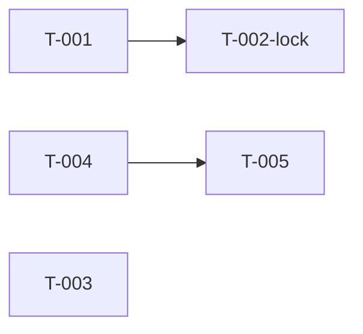

# Build Site: Matched Arrival UX

## Source Kits
- cavekit-matched-arrival-ux.md: R1 (mini snap for matched), R2 (cancel fee warning), R3 (arrived sub-state)

## Related Kits (context only — not in scope for this plan)
- cavekit-driver-reveal-ui.md: matched body content, ETA countdown, haptic, camera already owned

## Framework Context
- Expo 54 / React Native 0.81 / React 19 / TypeScript strict
- Reanimated worklets for booking sheet gesture (`isBookingModeShared`)
- Zustand for UI and app state
- Booking modal sheet is a single mounted component whose body swaps by `rideState`
- French (`@rentascooter/i18n`) is mandatory for all visible strings

## Implementation Sequence

### T-001: Audit gesture lock — confirm matched never dismisses
**Cavekit Requirement:** matched-arrival-ux/R1
**Acceptance Criteria Mapped:**
- Dragging while `rideState === 'matched'` snaps to mini
- No drag distance, velocity, or direction dismisses sheet in matched
- No programmatic path dismisses sheet in matched
**blockedBy:** none
**Effort:** S
**Description:** Locate the booking sheet gesture worklet (the one driven by `isBookingModeShared=1`). Read the snap-selection logic and the dismiss guard to confirm that:
  1. When the shared flag indicates matching mode, the gesture produces the `mini` snap at the same translation threshold as booking mode.
  2. No branch of the worklet (velocity, fling, underscroll) sets the sheet to `closed`/`dismissed` while in matched mode.
  3. No caller outside the worklet (e.g. timers, state reducers, back handler) can close the sheet while `rideState === 'matched'`.
Produce a short note listing each code path inspected and its outcome. If any gap is found, open a follow-up in T-002-lock.
**Files:** Booking sheet gesture handler file(s), booking sheet container, any back-handler hook.
**Test Strategy:** Static read-through + manual device test in demo mode: force matched, drag down fast (fling), drag down slow, drag down far — sheet must land at mini and never close.
**Time Guard:** 15 min (investigation)

### T-002-lock: Patch gesture/dismiss guards [CONDITIONAL]
**Cavekit Requirement:** matched-arrival-ux/R1
**Acceptance Criteria Mapped:**
- No drag distance, velocity, or direction dismisses sheet in matched
- No programmatic path dismisses sheet in matched
**Condition:** Only if T-001 finds a code path where the sheet can dismiss (drag-based or programmatic) while `rideState === 'matched'`.
**blockedBy:** T-001
**Effort:** S
**Description:** For each gap T-001 identified, add a guard keyed on the matched mode shared value (worklet-safe) or on the ride state (JS-thread caller). Guards must keep the mini snap reachable — only the closed/dismissed state is forbidden in matched. Do not introduce a new sheet mode.
**Files:** Same files as T-001.
**Test Strategy:** Re-run T-001 manual checks; add a repro for each gap and confirm the guard holds.
**Time Guard:** 15 min

### T-003: Mini strip matched content (driver name + ETA, no destination)
**Cavekit Requirement:** matched-arrival-ux/R1
**Acceptance Criteria Mapped:**
- Mini strip renders matched driver's name as visible text node
- Mini strip renders current ETA using cavekit-driver-reveal-ui R2 format
- Mini strip does not render booking destination while matched
- Tapping mini strip expands to peek snap level
- Expanding from mini to peek re-renders full matched body (cavekit-driver-reveal-ui R1)
**blockedBy:** none
**Effort:** M
**Description:** In the booking sheet's mini-strip render branch, switch content based on `rideState`:
  1. When `rideState === 'matched'`, render a strip with the driver name (from the same source the matched body uses) and the ETA label produced by the existing countdown hook (so formatting stays identical: `"X min"` or `"Arrivée imminente"`).
  2. Do not render the destination chip/text in this branch — the destination branch is the non-matched case.
  3. Preserve existing tap-to-expand behaviour: the strip already snaps back to peek on tap; confirm the same gesture target covers the matched strip.
  4. On expansion, the peek body must render the full matched layout owned by cavekit-driver-reveal-ui R1 — no changes to that component.
Reuse the matched-body driver-name source and ETA hook; do not duplicate state. Keep all strings French.
**Files:** Booking sheet mini-strip component, matched body index/export (for shared selectors/hooks).
**Test Strategy:** Demo flow: book → match → drag to mini → verify driver name and ETA values match what the peek body shows. Verify "Destination" copy is absent. Tap strip → peek shows full matched body. Let ETA tick — strip updates in lockstep with peek.
**Design Ref:** DESIGN.md — booking sheet mini strip typography and spacing
**Time Guard:** 2 hrs (M)

### T-004: Two-step cancel — insert fee warning before confirm
**Cavekit Requirement:** matched-arrival-ux/R2
**Acceptance Criteria Mapped:**
- In matched (before arrived), cancel control presents warning step first
- Warning displays exact string "Votre conducteur est en route — des frais d'annulation peuvent s'appliquer."
- Warning does not display any numeric fee amount or currency value
- After confirming warning, the standard cancel confirmation step is presented
- Cancel action only commits after the second (standard) step confirm
- Dismissing warning without confirming does not commit cancel
- Dismissing standard confirmation without confirming does not commit cancel
- In searching state, cancel control does not present the warning step
- All strings in warning step are in French
**blockedBy:** none
**Effort:** M
**Description:** Wrap the matched body's cancel handler so that, when pressed while `rideState === 'matched'` AND the arrived sub-state is not active (see R3), it opens a warning modal/sheet BEFORE the existing confirm-cancel dialog. Flow:
  1. User taps cancel in matched body → warning step appears.
  2. Warning step shows the exact French string above as a single visible text node, plus "Continuer" (proceed) and "Retour" (dismiss) controls. No numeric or currency content.
  3. "Retour" / backdrop / swipe-dismiss closes the warning and does NOT call the cancel action.
  4. "Continuer" closes the warning and opens the existing confirm-cancel dialog with no behavioural change to that dialog.
  5. The cancel action only fires on the existing dialog's confirm.
  6. In `rideState === 'searching'`, the cancel flow stays identical to today — no warning step.
Add the French strings via `@rentascooter/i18n` (new keys) rather than inline literals, but the displayed text must match exactly.
**Files:** Matched body cancel wrapper, new warning dialog component (or reuse existing dialog primitive), `packages/i18n` fr+en string tables, existing confirm-cancel dialog caller (change only entry point).
**Test Strategy:** Demo cases:
  - Matched, not arrived, tap cancel → warning → dismiss → assert no cancel fired.
  - Matched, not arrived, tap cancel → warning → continue → confirm → assert cancel fired.
  - Matched, not arrived, tap cancel → warning → continue → dismiss confirm → assert no cancel fired.
  - Searching, tap cancel → no warning, goes straight to confirm as before.
  - Snapshot/string check: warning copy equals the exact string; regex-negative assertion on digits and currency tokens.
**Design Ref:** DESIGN.md — dialog/warning patterns, typography, primary vs secondary button treatments
**Time Guard:** 2 hrs (M)

### T-005: Arrived sub-state — latched local UI state + arrived body, cancel hidden
**Cavekit Requirement:** matched-arrival-ux/R3
**Acceptance Criteria Mapped:**
- When ETA reaches zero while `rideState === 'matched'`, body switches to arrived layout
- Arrived renders exact string "Conducteur arrivé" as visible text node
- Arrived renders exact string "En attente de vous" as visible text node
- Arrived does not render a cancel control
- Once entered, subsequent ETA changes (incl. non-zero) do not revert to non-arrived matched layout
- Entering arrived does not change `rideState` (remains `matched`)
- Entering arrived does not introduce a new sheet-mode value
- In demo mode, arrived is entered when local ETA countdown reaches zero
- All strings in arrived layout are in French
**blockedBy:** T-004
**Effort:** M
**Description:** Add a local `hasArrived` latch inside the matched body (component `useState` or a narrow selector on the existing store — do NOT add a new `rideState` value, do NOT add a new sheet-mode value). Behaviour:
  1. Subscribe to the same ETA value driven by cavekit-driver-reveal-ui R2. The instant the remaining ETA reaches zero while `rideState === 'matched'`, set `hasArrived = true`.
  2. Once `hasArrived === true`, never set it back to false for the remainder of `rideState === 'matched'` — even if the ETA value is later mutated to a non-zero number. Reset only on exit of the matched ride state (unmount/reset of the matched body).
  3. When `hasArrived === true`, render the arrived body in place of the matched layout inside the SAME sheet body slot. Arrived body must render two visible text nodes with exactly `"Conducteur arrivé"` and `"En attente de vous"`. Route strings through `@rentascooter/i18n` (fr keys) but displayed text must match exactly.
  4. Arrived body renders NO cancel control. As a consequence, the two-step cancel warning from T-004 is never reachable in arrived — T-004's gating check ("before arrived") is satisfied by the cancel simply not being present.
  5. Mini strip behaviour from T-003 remains valid in arrived: the strip should still show driver name + ETA label per R1. (ETA label after zero remains "Arrivée imminente" per cavekit-driver-reveal-ui R2, so the strip stays coherent.)
  6. Demo mode: the existing local demo countdown already drives ETA to zero, so no special demo hook is needed — arrived triggers naturally when the countdown bottoms out.
**Files:** Matched body component (arrived branch + `hasArrived` latch), i18n fr/en tables (`driver.arrivedTitle`, `driver.arrivedSubtitle`), matched body cancel region (guard to render null when `hasArrived`).
**Test Strategy:** Demo flow:
  - Start with short demo ETA → match → wait to zero → assert arrived body renders both strings and no cancel control.
  - After arrived, simulate the ETA reducer publishing a non-zero value → assert body stays arrived (latch held).
  - Assert `rideState` remains `'matched'` and no new sheet mode is introduced (inspect store selectors).
  - Leave matched (reset ride) → re-enter matched with non-zero ETA → assert arrived is NOT active on entry.
  - Drag to mini while arrived → strip still shows driver name + ETA label.
**Design Ref:** DESIGN.md — empty/idle state typography, centered copy block
**Time Guard:** 2 hrs (M)

## Build Site

### Tier 0 — No Dependencies (Start Here — run in parallel)
- T-001: Audit gesture lock → matched-arrival-ux/R1
- T-003: Mini strip matched content → matched-arrival-ux/R1
- T-004: Two-step cancel fee warning → matched-arrival-ux/R2

### Tier 1 — Depends on Tier 0
- T-002-lock [CONDITIONAL]: Patch gesture/dismiss guards (blockedBy: T-001) → matched-arrival-ux/R1
- T-005: Arrived sub-state latch + body + cancel hide (blockedBy: T-004) → matched-arrival-ux/R3

### Dependency Graph

Notes on parallelism:
- T-001, T-003, T-004 can be worked in parallel — they touch different concerns (gesture audit, mini strip content, cancel flow).
- T-005 is sequenced after T-004 because the arrived body must not render a cancel control, and T-004 is the last touch on the matched cancel surface — doing T-004 first keeps the arrived-body guard (`hasArrived ? null : <Cancel/>`) landing cleanly without a merge shuffle.
- T-002-lock only runs if T-001 uncovers a gap; otherwise R1's no-dismiss criteria are already met by existing code.

## Coverage Matrix

### R1 — Mini state for matched modal
| Acceptance Criterion | Task(s) |
|---|---|
| Dragging while matched snaps to mini | T-001 (verify), T-002-lock (conditional) |
| No drag dismisses sheet in matched | T-001 (verify), T-002-lock (conditional) |
| No programmatic path dismisses sheet in matched | T-001 (verify), T-002-lock (conditional) |
| Strip renders matched driver's name | T-003 |
| Strip renders current ETA (cavekit-driver-reveal-ui R2 format) | T-003 |
| Destination not rendered in matched strip | T-003 |
| Tap mini strip expands to peek | T-003 |
| Expanding to peek re-renders full matched body (cavekit-driver-reveal-ui R1) | T-003 |

### R2 — Cancellation fee warning (two-step)
| Acceptance Criterion | Task(s) |
|---|---|
| In matched (before arrived), cancel presents warning step first | T-004 |
| Warning displays exact French string | T-004 |
| Warning has no numeric fee amount or currency | T-004 |
| After warning confirm, standard cancel dialog presents | T-004 |
| Cancel commits only after second (standard) confirm | T-004 |
| Dismissing warning does not commit cancel | T-004 |
| Dismissing standard confirmation does not commit cancel | T-004 |
| In searching, cancel does not present warning | T-004 |
| All warning strings in French | T-004 |

### R3 — Driver arrived sub-state
| Acceptance Criterion | Task(s) |
|---|---|
| ETA reaches zero while matched → body switches to arrived | T-005 |
| Arrived renders "Conducteur arrivé" | T-005 |
| Arrived renders "En attente de vous" | T-005 |
| Arrived renders no cancel control | T-005 |
| Latched: non-zero ETA after arrived does not revert | T-005 |
| Entering arrived does not change `rideState` | T-005 |
| Entering arrived does not introduce a new sheet-mode value | T-005 |
| Demo: arrived entered when local ETA countdown reaches zero | T-005 |
| All arrived strings in French | T-005 |

All 26 acceptance criteria across R1/R2/R3 are mapped to at least one task. No gaps.

## Risk Notes

- **R1 verify-then-patch shape:** T-001 is a read-only audit. If the gesture worklet already fully satisfies the no-dismiss criteria (the kit suggests it does via `isBookingModeShared=1`), T-002-lock is skipped — this is the expected path.
- **Mini strip ETA coupling:** T-003 must source the ETA from the same hook the matched body uses, otherwise the strip and peek can drift. Reuse, do not re-derive.
- **Arrived vs cancel interplay:** T-005 removes the cancel control in arrived rather than gating T-004's warning by `hasArrived`. This is simpler and structurally enforces the R3 no-cancel criterion — the warning step can't be reached because the trigger isn't rendered.
- **i18n discipline:** All French strings in R2 and R3 must match exactly. Use i18n keys, but pin the displayed values in tests (exact-string assertions) to catch accidental copy edits.
- **No new state machine values:** R3 explicitly forbids new `rideState` values and new sheet modes. The latch must be local to the matched body (or a narrow selector) — do not extend the global ride-state enum or sheet-mode enum.
