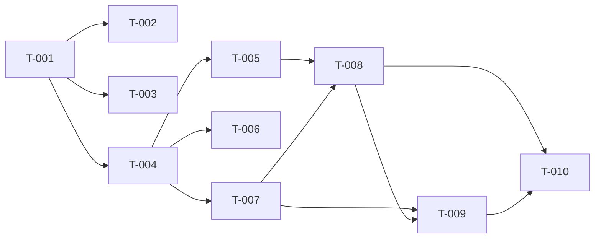

# Build Site — Trip Receipt & Rating

10 tasks across 5 tiers from 2 kits.

---

## Tier 0 — No Dependencies (Start Here)

| Task ID | Title | Effort | Kit | Requirements |
|---------|-------|--------|-----|--------------|
| T-001 | TripReceipt Component | L | cavekit-trip-receipt.md | R1, R2 |

---

## Tier 1 — Depends on Tier 0

| Task ID | Title | Effort | Kit | Requirements | blockedBy |
|---------|-------|--------|-----|--------------|-----------|
| T-002 | TripReceipt Torn-Edge Visual Treatment | S | cavekit-trip-receipt.md | R4 | T-001 |
| T-003 | TripReceipt PDF Download Stub | S | cavekit-trip-receipt.md | R3 | T-001 |
| T-004 | Receipt Screen Route Wiring | M | cavekit-post-ride-rating.md | R1 (AC2, AC3), R6 (AC1, AC2, AC4) | T-001 |

---

## Tier 2 — Depends on Tier 1

| Task ID | Title | Effort | Kit | Requirements | blockedBy |
|---------|-------|--------|-----|--------------|-----------|
| T-005 | Auto-Navigation to Receipt Screen on Completion | M | cavekit-post-ride-rating.md | R1 (AC1, AC4, AC5) | T-004 |
| T-006 | Ride History Entry Point | S | cavekit-post-ride-rating.md | R6 (AC1, AC2, AC3, AC4, AC5) | T-004 |
| T-007 | Rating Modal Component | M | cavekit-post-ride-rating.md | R3, R4 | T-004 |

---

## Tier 3 — Depends on Tier 2

| Task ID | Title | Effort | Kit | Requirements | blockedBy |
|---------|-------|--------|-----|--------------|-----------|
| T-008 | Rating Modal Auto-Show Logic | M | cavekit-post-ride-rating.md | R2 | T-005, T-007 |
| T-009 | Rating Submission | M | cavekit-post-ride-rating.md | R5 | T-007, T-008 |

---

## Tier 4 — Depends on Tier 3

| Task ID | Title | Effort | Kit | Requirements | blockedBy |
|---------|-------|--------|-----|--------------|-----------|
| T-010 | Ride State Reset After Flow Completion | S | cavekit-post-ride-rating.md | R7 | T-008, T-009 |

---

## Task Details

### T-001 — TripReceipt Component
**Cavekit:** cavekit-trip-receipt.md
**Requirements:** R1, R2
**Effort:** L
**blockedBy:** none
**Description:**
Build a standalone, props-driven `TripReceipt` React Native component. The component accepts a `Ride` object (or subset) as props and renders the full receipt layout: driver header row (avatar/initials, name, total fare XOF, distance, payment tag, discount tag when applicable); PICK UP section; DROP OFF section; NOTED section (conditional — only when rider note present, fully omitted otherwise); TRIP FARE section with base fare, distance fare, and time fare as distinct line items; Amount Paid total (visually distinct). All monetary values use XOF thousands-separator formatting (matching rides.tsx pattern). Missing fields render a safe empty representation or are omitted without crashing. The component reads from no global store, triggers no navigation, makes no network call, and can be dropped into the post-ride screen, the ride history detail view, or a driver-app screen without modification. The only side effect it may expose is the PDF stub interaction (R3).

---

### T-002 — TripReceipt Torn-Edge Visual Treatment
**Cavekit:** cavekit-trip-receipt.md
**Requirements:** R4
**Effort:** S
**blockedBy:** T-001
**Description:**
Add a scalloped, perforated, or torn-edge visual treatment to the top edge, bottom edge, or both edges of the TripReceipt component's card boundary. The treatment must be clearly distinct from a straight edge, must be part of the card's visible boundary (not a floating decoration), must render correctly across all supported device widths, and must be consistent across the post-ride and ride-history surfaces.

---

### T-003 — TripReceipt PDF Download Stub
**Cavekit:** cavekit-trip-receipt.md
**Requirements:** R3
**Effort:** S
**blockedBy:** T-001
**Description:**
Add a "Download PDF" text link to the TripReceipt component, localised for both French and English. Tapping the link shows a transient "coming soon" message (e.g. Toast or Alert). The link produces no file, opens no browser, and makes no network call. The link must never be a dead tap — visible feedback is always shown.

---

### T-004 — Receipt Screen Route Wiring
**Cavekit:** cavekit-post-ride-rating.md
**Requirements:** R1 (AC2, AC3), R6 (AC1, AC2, AC4)
**Effort:** M
**blockedBy:** T-001
**Description:**
Create the Expo Router screen at `app/(main)/trip-receipt/[rideId].tsx`. The screen accepts a `rideId` route parameter. It resolves the `Ride` object for that ID (from the rideStore's current completed ride or from the ride history query, depending on entry point), then renders the TripReceipt component populated with that data. Accept an optional `entryPoint` query param (`'completion' | 'history'`) to distinguish the two flows (controls modal visibility in T-008 and read-only gating in T-006). Standard back navigation works from this screen.

---

### T-005 — Auto-Navigation to Receipt Screen on Completion
**Cavekit:** cavekit-post-ride-rating.md
**Requirements:** R1 (AC1, AC4, AC5)
**Effort:** M
**blockedBy:** T-004
**Description:**
In the app's ride lifecycle observer (likely `app/(main)/index.tsx` or the rideStore effect in BookingSheet), detect when the rideStore transitions into the `completed` state and perform a forward `router.push` to `/trip-receipt/[rideId]?entryPoint=completion`. The navigation must fire exactly once per completion event (guard against re-firing if the screen is already shown). Use a forward push (not replace) so back navigation semantics remain valid for the history entry flow.

---

### T-006 — Ride History Entry Point
**Cavekit:** cavekit-post-ride-rating.md
**Requirements:** R6 (AC1, AC2, AC3, AC4, AC5)
**Effort:** S
**blockedBy:** T-004
**Description:**
In the ride history screen (`app/(main)/rides.tsx`), make each ride card tappable, navigating to `/trip-receipt/[rideId]?entryPoint=history`. The receipt screen opened this way renders the same TripReceipt component with that ride's data. The rating modal must NOT auto-appear on the history entry point (enforced by the `entryPoint` param). Standard back navigation returns to the ride history screen. When the past ride already has a `clientToDriver` rating, no submission affordance is offered (read-only).

---

### T-007 — Rating Modal Component
**Cavekit:** cavekit-post-ride-rating.md
**Requirements:** R3, R4
**Effort:** M
**blockedBy:** T-004
**Description:**
Build the rating modal UI component. It contains: (a) an interactive 1–5 star rating input that reuses the existing `StarRating` component from `@rentascooter/ui` with `interactive={true}` and `onRatingChange` — selected state visually distinguishable, changeable before submit; (b) an optional comment `TextInput` with a hard 280-character max (enforced in the input), a visible remaining-characters counter; (c) a submit button disabled until a star rating is selected; (d) an explicit dismiss affordance. The component accepts `onSubmit(rating, comment?)` and `onDismiss` callbacks, plus a `loading` prop that disables the submit button and shows a loading indicator while submission is in flight. Comment value is omitted from the payload (not sent as empty string) when the field is empty.

---

### T-008 — Rating Modal Auto-Show Logic
**Cavekit:** cavekit-post-ride-rating.md
**Requirements:** R2
**Effort:** M
**blockedBy:** T-005, T-007
**Description:**
On the receipt screen (`app/(main)/trip-receipt/[rideId].tsx`), implement the modal auto-show logic. When `entryPoint === 'completion'`, start a 5-second timeout on mount that calls `setModalVisible(true)`. Cancel the timeout on unmount so the modal cannot appear on a different screen after the rider navigates away. When `entryPoint === 'history'`, do not start the timeout (modal never auto-shows). Dismissing the modal without submitting navigates the rider to the map home screen (`router.replace('/')`). The modal is dismissible at any time via the dismiss affordance from T-007.

---

### T-009 — Rating Submission
**Cavekit:** cavekit-post-ride-rating.md
**Requirements:** R5
**Effort:** M
**blockedBy:** T-007, T-008
**Description:**
Implement the rating submission handler on the receipt screen. Calling `submitRating` sends a payload of `{ rideId, rating: number (1–5), comment?: string }` to the backend callable (Firebase Cloud Function — stub with a graceful error if the callable doesn't exist yet). On success: navigate to the map home screen (`router.replace('/')`); persist the rating as `clientToDriver` on the ride's local data (rideStore update or optimistic local write). On failure: show an error message within the modal and keep the modal open with star selection and comment intact so the rider can retry. While in flight: the submit button is in loading/disabled state (no double-submit).

---

### T-010 — Ride State Reset After Flow Completion
**Cavekit:** cavekit-post-ride-rating.md
**Requirements:** R7
**Effort:** S
**blockedBy:** T-008, T-009
**Description:**
After the post-ride flow concludes — either via successful rating submission (T-009) or via modal dismissal (T-008) — reset the rideStore state to `idle`. After the reset, the booking bottom sheet must return to its initial search mode, and no stale driver info, fare, or route data from the completed ride must remain in the new-ride entry UI. This reset must NOT fire when the receipt screen is opened from the history entry point (`entryPoint === 'history'`).

---

## Summary

| Tier | Task Count | Tasks |
|------|------------|-------|
| Tier 0 | 1 | T-001 |
| Tier 1 | 3 | T-002, T-003, T-004 |
| Tier 2 | 3 | T-005, T-006, T-007 |
| Tier 3 | 2 | T-008, T-009 |
| Tier 4 | 1 | T-010 |

**Total: 10 tasks, 5 tiers**

---

## Coverage Matrix

| Kit | Requirement | Criteria Count | Task(s) | Status |
|-----|-------------|----------------|---------|--------|
| cavekit-trip-receipt.md | R1 | 8 | T-001 | COVERED |
| cavekit-trip-receipt.md | R2 | 5 | T-001 | COVERED |
| cavekit-trip-receipt.md | R3 | 4 | T-003 | COVERED |
| cavekit-trip-receipt.md | R4 | 4 | T-002 | COVERED |
| cavekit-post-ride-rating.md | R1 (AC1, AC4, AC5) | 3 | T-005 | COVERED |
| cavekit-post-ride-rating.md | R1 (AC2, AC3) | 2 | T-004 | COVERED |
| cavekit-post-ride-rating.md | R2 | 6 | T-008 | COVERED |
| cavekit-post-ride-rating.md | R3 | 5 | T-007 | COVERED |
| cavekit-post-ride-rating.md | R4 | 5 | T-007 | COVERED |
| cavekit-post-ride-rating.md | R5 | 6 | T-009 | COVERED |
| cavekit-post-ride-rating.md | R6 | 5 | T-006 | COVERED |
| cavekit-post-ride-rating.md | R7 | 5 | T-010 | COVERED |

**Coverage: 58/58 criteria (100%)**

---

## Dependency Graph

---

## Architect Report

**Scope**
- Kits planned: `cavekit-trip-receipt.md` (4 requirements, 21 criteria), `cavekit-post-ride-rating.md` (7 requirements, 37 criteria).
- Total criteria covered: 58/58 (100%).
- Tasks generated: 10 across 5 dependency tiers.

**Sequencing Rationale**
- Tier 0 establishes the pure presentational `TripReceipt` component (T-001) as the foundational artifact — it is prop-driven with no store, navigation, or network dependencies, so all downstream surfaces can compose it.
- Tier 1 splits cleanly into three parallelizable tracks off T-001: visual polish (T-002), the PDF stub affordance (T-003), and the receipt route wiring (T-004). The route wiring (T-004) is the pivot point for every post-ride-rating task.
- Tier 2 forks into three independent children of T-004: completion-flow auto-navigation (T-005), history-entry tappable cards (T-006), and the rating modal component (T-007). These can be built in parallel.
- Tier 3 joins T-005 + T-007 into the auto-show timing logic (T-008), then T-007 + T-008 into submission wiring (T-009). This separation keeps submission logic independent of timing/navigation concerns.
- Tier 4 performs the terminal rideStore reset (T-010) once both the dismissal path (T-008) and the successful-submission path (T-009) exist.

**Parallelization Opportunities**
- After T-001 lands, T-002 / T-003 / T-004 can proceed in parallel.
- After T-004 lands, T-005 / T-006 / T-007 can proceed in parallel.
- T-008 and T-009 share a dependency on T-007; T-009 additionally depends on T-008's modal visibility plumbing and must therefore land after it.

**Risks and Assumptions**
- T-009 assumes the Firebase Cloud Function for rating submission either exists or can be gracefully stubbed client-side without blocking the flow. If no callable is yet defined, the builder should keep the UX intact behind a feature-flag or in-modal error state rather than fail the tier.
- T-005 relies on a single observable transition point into the `completed` rideStore state. If more than one observer could fire the navigation, the once-per-completion guard in T-005 is load-bearing — builders must verify no duplicate pushes.
- T-006's read-only behaviour for already-rated rides assumes the ride-history record carries the `clientToDriver` field. If the history API does not expose that field yet, the builder should treat absence as "not yet rated" and flag the gap.
- T-002's torn-edge treatment is aesthetic; builders should prefer an SVG mask or repeating background approach over native clip-paths to keep cross-device rendering consistent.

**Validation Plan**
- Each task's acceptance criteria map back to the kits' requirement tables; builders verify against those criteria at merge.
- Coverage matrix above confirms every criterion across both kits has at least one assigned task.
- Dependency graph has been visually inspected for cycles — none found.
