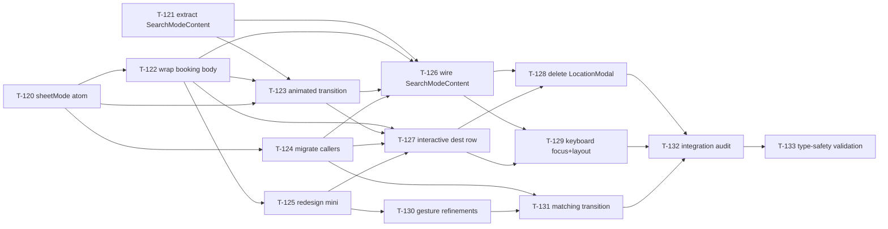

# Build Site: Unified Booking Modal

14 tasks across 4 tiers. Delta build — covers only new/updated requirements introduced by
the unified sheet (booking-sheet-ux R2-update, R3-update, R10-new; location-search R7-update).
Previous tasks T-001–T-119 are DONE and not repeated here.

Stack: Expo 54 / React Native 0.81 / React 19, Reanimated 4.x (`useSharedValue`, `withSpring`,
`runOnJS`), RNGH v2 (`Gesture.Pan`, `GestureDetector`), Zustand 4 (`useUIStore` in
`packages/shared/src/stores/uiStore.ts`), TypeScript strict, Expo Router.

Current source anchors the builders need to know:
- `components/BookingSheet/BookingSheet.tsx` — 3 snap points already wired (MINI=155, PEEK=330,
  FULL=580) but mini body today is a condensed route summary, not a "condensed destination row"
  matching R3. Destination chevron affordance is not rendered. No mode machine.
- `components/LocationModal/LocationModal.tsx` — standalone overlay; contains the search input,
  suggestion list, history list. Its content will be the body of the new search-mode surface.
- `packages/shared/src/stores/uiStore.ts` — currently exposes `isLocationModalOpen` boolean +
  `activeBottomSheet` enum. Both must be replaced by a single `sheetMode` atom.
- `app/(main)/index.tsx` — renders `<LocationModal>` and `<BookingSheet>` as two separate
  components; opens `LocationModal` via `openLocationModal()`. This becomes one unified sheet
  with internal mode routing.

---

## Tier 0 — No Dependencies

| Task | Title | Cavekit | Requirement | Effort |
|------|-------|---------|-------------|--------|
| T-120 | Introduce `sheetMode` atom in `useUIStore` | booking-sheet-ux | R10 (ACs 4, 5) | S |
| T-121 | Extract `LocationModal` content into reusable `SearchModeContent` component | location-search | R7 (AC 2, 3, 7) | M |

### T-120: Introduce `sheetMode` atom in `useUIStore`
**Cavekit Requirement:** booking-sheet-ux/R10
**Acceptance Criteria Mapped:** R10 AC 4 (sheetMode exposes idle|search|booking|matching), R10 AC 5 (no separate booleans for overlay + sheet)
**blockedBy:** none
**Effort:** S
**Description:**
- In `packages/shared/src/stores/uiStore.ts`:
  - Add `export type SheetMode = 'idle' | 'search' | 'booking' | 'matching';`
  - Replace `isLocationModalOpen: boolean` + `activeBottomSheet: BottomSheetType` with a single `sheetMode: SheetMode` field initialised to `'idle'`.
  - Replace `openLocationModal()` / `closeLocationModal()` / `setActiveBottomSheet()` with a single `setSheetMode(mode: SheetMode)` action.
  - Export new selector `selectSheetMode`.
  - Keep sidebar state untouched.
  - Remove `BottomSheetType` export (or deprecate; nothing else consumes the `'rideDetails' | 'scooterSelection'` variants today).
- This task deliberately breaks callers — downstream tasks re-wire them to the new atom.
**Files:** `packages/shared/src/stores/uiStore.ts`, `packages/shared/src/stores/index.ts` (update export surface).
**Test Strategy:** `yarn tsc --noEmit` on the `@rentascooter/shared` package must pass. Grep for `isLocationModalOpen|openLocationModal|closeLocationModal|activeBottomSheet|setActiveBottomSheet` must only return hits inside tasks downstream of T-120.

### T-121: Extract `LocationModal` content into reusable `SearchModeContent` component
**Cavekit Requirement:** location-search/R7
**Acceptance Criteria Mapped:** R7 AC 2 (renders suggestions using R5 Suggestion shape), R7 AC 3 (renders history alongside autocomplete), R7 AC 7 (no sessionToken state/prop/ref)
**blockedBy:** none
**Effort:** M
**Description:**
- Create `components/BookingSheet/SearchModeContent.tsx`:
  - Props: `{ userName: string; onSelectSuggestion: (s: Suggestion) => void; onSelectHistory: (loc: Location) => void; }`
  - Move the following out of `LocationModal.tsx` as-is: header ("Welcome, {userName}"), `SearchInput` (imported from `components/LocationModal/SearchInput.tsx`), `useAutocompleteLocation` call, `useLocationHistory` call, suggestion vs. history list switching based on query length, scroll-start/scroll-end keyboard dismissal hooks, `retrieveError` state.
  - Preserve exactly the branching: `isSearching ? <LocationSearchList /> : <LocationHistoryList />`.
  - Component owns its own `searchQuery` state and `searchInputRef`, but exposes no `isOpen`/`onClose` props — parent (unified sheet) controls visibility via mode.
  - Must not declare or reference `sessionToken` in any form. Grep the file for `/session.?token/i` → zero hits required.
- Re-export from `components/BookingSheet/index.ts`.
- Note: this task only *creates* the component — wiring into BookingSheet happens in T-126.
**Files:** new `components/BookingSheet/SearchModeContent.tsx`; update `components/BookingSheet/index.ts` to re-export.
**Test Strategy:** `yarn tsc --noEmit` clean. Component renders in isolation via a scratch screen (builder discards). Grep for `sessionToken` in the new file returns 0.

---

## Tier 1 — Depends on Tier 0

| Task | Title | Cavekit | Requirement | Effort |
|------|-------|---------|-------------|--------|
| T-122 | Add `BookingModeContent` wrapper around existing booking body | booking-sheet-ux | R10 (ACs 1, 2) | S |
| T-123 | Implement animated mode transition (search ↔ booking) | booking-sheet-ux | R10 (ACs 3, 7, 8, 10) | M |
| T-124 | Migrate all `useUIStore` callers to `sheetMode` atom | booking-sheet-ux | R10 (AC 5); location-search R7 (AC 8) | M |

### T-122: Add `BookingModeContent` wrapper around existing booking body
**Cavekit Requirement:** booking-sheet-ux/R10
**Acceptance Criteria Mapped:** R10 AC 1 (sheet renders exactly one of two modes), R10 AC 2 (mode transition within single sheet instance; no unmount/remount)
**blockedBy:** T-120
**Effort:** S
**Description:**
- Inside `components/BookingSheet/BookingSheet.tsx`, extract the existing peek/full body (currently the `<View style={styles.body}>` branch at lines 283–345) into an internal component `BookingModeContent` (kept in the same file to avoid prop-drilling existing `useMatching` + gesture state).
- The BookingSheet root `<GestureDetector><Animated.View>` container stays mounted across all modes — only inner content switches. Enforce this by having a single `<Animated.View>` with a conditional child: `mode === 'search' ? <SearchModeContent /> : <BookingModeContent />`.
- Handle zone (drag handle + X button) stays rendered in both modes.
**Files:** `components/BookingSheet/BookingSheet.tsx`.
**Test Strategy:** Manual: open sheet in search mode, transition to booking mode, confirm React DevTools shows the `Animated.View` instance persists (same fiber key) across the switch. Unit-level — add a `data-testid` or equivalent guard for identity if needed.

### T-123: Implement animated mode transition (search ↔ booking)
**Cavekit Requirement:** booking-sheet-ux/R10
**Acceptance Criteria Mapped:** R10 AC 3 (mode transition is animated, not instantaneous), R10 AC 7 (destination confirm → booking in same instance), R10 AC 8 (tap destination row in booking → search), R10 AC 10 (mode transition completes before fare loading indicator visible)
**blockedBy:** T-120, T-121, T-122
**Effort:** M
**Description:**
- In `BookingSheet.tsx`, read `sheetMode` via `useUIStore(selectSheetMode)`.
- Drive a Reanimated shared value `modeProgress` (0 = search, 1 = booking) with `withTiming({ duration: 260, easing: Easing.out(Easing.cubic) })` on mode change.
- Use `useAnimatedStyle` to cross-fade the two inner content surfaces: search opacity = `interpolate(modeProgress, [0, 1], [1, 0])`, booking opacity = inverse. Both render during transition but are absolutely positioned so they overlap during the crossfade.
- Gate booking-mode fare spinner with the transition state: booking content's `isFareLoading` UI must be suppressed until `modeProgress >= 1`. Implement by gating on a JS-side `hasCompletedSearchToBookingTransition` flag (set via `runOnJS` on animation end) so that while `modeProgress < 1`, the spinner never renders.
- Search-mode content mounts when `sheetMode === 'search'`; booking-mode mounts when `sheetMode === 'booking' | 'matching'`. Both can be mounted simultaneously only during the transition window; after the animation completes, the unused branch unmounts to release keyboard listeners.
- Destination row tap from booking mode: calls `setSheetMode('search')` (wired in T-125/T-127).
- Destination confirmation in search mode: parent handler (T-126) calls `setSheetMode('booking')`.
**Files:** `components/BookingSheet/BookingSheet.tsx`.
**Test Strategy:** Manual: record a screen capture of search → booking; confirm a ~260ms crossfade occurs and the fare row renders already populated. Validate AC 10 by setting the fare request to a 400ms artificial delay and confirming no spinner flashes.

### T-124: Migrate all `useUIStore` callers to `sheetMode` atom
**Cavekit Requirement:** booking-sheet-ux/R10; location-search/R7
**Acceptance Criteria Mapped:** R10 AC 5 (sheet-mode atom is sole source of truth), R10 AC 6 (entering destination flow sets sheetMode=search), R7 AC 8 (no code path opens/dismisses destination-search UI independently of sheetMode atom)
**blockedBy:** T-120
**Effort:** M
**Description:**
- Grep for `openLocationModal|closeLocationModal|isLocationModalOpen|setActiveBottomSheet|activeBottomSheet` across the app; expected hits at the time of writing:
  - `app/(main)/index.tsx` lines 70, 234–237, 242–245, 275–296, 321–326, 427
  - `components/LocationModal/LocationModal.tsx` — will be deleted in T-128, but during T-124 just leave it compiled against a stub so tests keep running.
- Replace every `openLocationModal()` with `setSheetMode('search')`.
- Replace every `closeLocationModal()` with `setSheetMode('idle')` (or `'booking'` if the call site is confirming a destination — see T-126).
- Replace `isLocationModalOpen` reads with `sheetMode === 'search'`.
- Replace the old `activeBottomSheet` layout-shift logic (e.g., `userPositionButtonBottom` at lines 324–326) with a selector over `sheetMode`.
- Remove the now-dead `showBookingSheet = selectedDestination !== null` computation from `app/(main)/index.tsx:125`; sheet visibility is now driven by `sheetMode !== 'idle'`.
**Files:** `app/(main)/index.tsx`, any other hit from the grep.
**Test Strategy:** `yarn tsc --noEmit` clean. Grep for the old API names returns 0 hits across the entire repo (outside the stores file itself, which no longer exports them).

---

## Tier 2 — Depends on Tier 1

| Task | Title | Cavekit | Requirement | Effort |
|------|-------|---------|-------------|--------|
| T-125 | Redesign mini-snap body to match R3 (condensed destination row) | booking-sheet-ux | R2 (ACs 2, 3); R3 (AC 5) | M |
| T-126 | Wire `SearchModeContent` into the sheet with unified destination-confirmation handler | location-search | R7 (ACs 4, 5); booking-sheet-ux R10 (AC 7) | M |
| T-127 | Make the destination row interactive (chevron + tap-to-search) at every snap + mode | booking-sheet-ux | R3 (ACs 2, 6, 7, 8) | M |
| T-128 | Delete standalone `LocationModal` overlay from app tree | location-search | R7 (AC 1); booking-sheet-ux R10 (AC 11) | S |

### T-125: Redesign mini-snap body to match R3 (condensed destination row)
**Cavekit Requirement:** booking-sheet-ux/R2, R3
**Acceptance Criteria Mapped:** R2 AC 2 (at mini, only condensed destination summary row is rendered), R2 AC 3 (map is maximally visible at mini), R3 AC 5 (destination row visible at mini/peek/full)
**blockedBy:** T-122
**Effort:** M
**Description:**
- Replace the current `styles.miniBody` content (pickup → destination route summary + Book Now) in `BookingSheet.tsx` with a single condensed destination row:
  - Row contents: leading location icon (`Icon name="map-pin"` from `@rentascooter/ui`), destination name (single line, `typography.body`, fontWeight 600), trailing chevron-right icon (T-127 adds the press target — here just render the visual).
  - Do NOT render the vehicle carousel, payment row, or Book Now control at mini.
  - Shrink `MINI_HEIGHT` from 155 to a value that wraps the single row + handle zone + bottom inset only (~96–110px) — validate by measuring the row's content box in the simulator.
- If destination is null (sheet is in search mode but snapped to mini), fall back to a placeholder "Where to?" row using the same shape.
- Design reference: DESIGN.md — use `colors.text.primary` for destination name, `colors.text.secondary` for address, `colors.border.light` for row divider consistent with existing booking body rows.
**Design Ref:** DESIGN.md — primary text / secondary text / border light tokens.
**Files:** `components/BookingSheet/BookingSheet.tsx`.
**Test Strategy:** Manual visual check at mini snap: only destination row + handle visible; map is visible above the sheet across at least 70% of the viewport; toggling mini ↔ peek shows the carousel appearing/disappearing.

### T-126: Wire `SearchModeContent` into the sheet with unified destination-confirmation handler
**Cavekit Requirement:** location-search/R7; booking-sheet-ux/R10
**Acceptance Criteria Mapped:** R7 AC 4 (selecting suggestion triggers detail resolution), R7 AC 5 (selection transitions sheet to booking mode), R10 AC 7 (confirming destination sets sheetMode=booking and renders booking-mode content in same sheet instance)
**blockedBy:** T-121, T-122, T-123, T-124
**Effort:** M
**Description:**
- In `BookingSheet.tsx`, when `sheetMode === 'search'`, render `<SearchModeContent>`.
- Lift the destination-confirmation handler out of `app/(main)/index.tsx:handleDestinationSelect` and pass it down through a new `onConfirmDestination(location)` prop on `BookingSheet`. Implementation:
  1. Call `await Haptics.impactAsync(...)`.
  2. Call the parent's `setSelectedDestination(location)`.
  3. Call `setSheetMode('booking')` — this triggers the T-123 animation.
  4. Fire the camera animation side-effect (existing `animateToLocation` call).
- `SearchModeContent.onSelectSuggestion` internally calls `placeDetail(suggestion.placeId)` (as today) then the propagated `onConfirmDestination`. Persistence to history (`saveHistory`) keeps its existing swallowed-failure behavior.
- `SearchModeContent.onSelectHistory` calls `onConfirmDestination` directly (history entries already carry lat/lng per location-search R3).
**Files:** `components/BookingSheet/BookingSheet.tsx`, `components/BookingSheet/SearchModeContent.tsx`, `app/(main)/index.tsx`.
**Test Strategy:** E2E manual: tap suggestion → sheet stays mounted, content crossfades, booking body renders with fare populated (no loading spinner visible per R10 AC 10). Tap history entry → same behavior. Select on a bad placeId → `retrieveError` surfaced in-surface.

### T-127: Make the destination row interactive (chevron + tap-to-search) at every snap + mode
**Cavekit Requirement:** booking-sheet-ux/R3
**Acceptance Criteria Mapped:** R3 AC 2 (visible trailing interactive affordance), R3 AC 6 (destination row visible in both modes), R3 AC 7 (tap from mini or peek transitions to search without navigation/new overlay), R3 AC 8 (tap from booking mode transitions to search mode)
**blockedBy:** T-122, T-123, T-124, T-125
**Effort:** M
**Description:**
- In `BookingSheet.tsx`:
  - Extract the destination row into a `DestinationRow` local component used in three places: mini body (T-125), peek/full booking body (replacing the existing `<View style={styles.row}>` that shows name/address at lines 287–297), and search mode (rendered as the sheet's top element in `SearchModeContent`).
  - Render the trailing chevron using `Icon name="chevron-right"` from `@rentascooter/ui`.
  - Wrap the full row in a `<Pressable>` (not a `TouchableOpacity` — we need `pointerEvents` to arbitrate cleanly with the parent `GestureDetector`). On press, call `setSheetMode('search')`. No `router.push`, no `openLocationModal`, no new overlay.
  - When `sheetMode === 'search'`, the destination row renders with placeholder text "Where to?" if destination is null, else the confirmed destination (matches R3 requirement that the row is visible in both modes).
  - The row must not intercept vertical drag: set `hitSlop` reasonable but ensure the surrounding gesture still owns drag translation — validate on both iOS and Android.
**Files:** `components/BookingSheet/BookingSheet.tsx`, `components/BookingSheet/SearchModeContent.tsx`.
**Test Strategy:** Manual QA: from mini snap tap the row → crossfades to search mode, keyboard focuses (per T-129). From peek snap tap row → same. From booking (peek or full) tap row → same. From search mode the row is visible at the top. Gesture arbitration check: vertical drag starting on the row still moves the sheet (does not get eaten by `Pressable`).

### T-128: Delete standalone `LocationModal` overlay from app tree
**Cavekit Requirement:** location-search/R7; booking-sheet-ux/R10
**Acceptance Criteria Mapped:** R7 AC 1 (zero standalone overlays outside unified sheet), R10 AC 11 (zero standalone destination-search modal/overlay instances anywhere in codebase)
**blockedBy:** T-126, T-127
**Effort:** S
**Description:**
- Delete `<LocationModal>` instance from `app/(main)/index.tsx` (lines 425–435).
- Delete import `import { LocationModal, DestinationTip } from '@/components/LocationModal';` from `app/(main)/index.tsx`. (Keep `DestinationTip` via separate import if still needed for the non-sheet destination tip banner.)
- Delete `components/LocationModal/LocationModal.tsx`. Keep the child components that `SearchModeContent` imports (`BottomSheet`, `SearchInput`, `LocationHistoryList`, `LocationSearchList`, `LocationRow`) — move them under `components/BookingSheet/search/` if desired, or leave in place.
- Update `components/LocationModal/index.ts` to export only the retained pieces (or delete if all consumers moved).
- Sanity grep: `rg "LocationModal"` across the repo must return zero results (except in .md docs / changelogs).
**Files:** `app/(main)/index.tsx`, `components/LocationModal/LocationModal.tsx` (delete), `components/LocationModal/index.ts` (update or delete), `components/index.ts` if it re-exports LocationModal.
**Test Strategy:** `rg -g '!context/**' -g '!*.md' "LocationModal"` returns 0. App builds (`yarn dev` → iOS simulator boot check). Opening the app presents the unified sheet in search mode immediately.

---

## Tier 3 — Depends on Tier 2

| Task | Title | Cavekit | Requirement | Effort |
|------|-------|---------|-------------|--------|
| T-129 | Search-mode keyboard focus + keyboard-aware layout | location-search | R7 (AC 6); booking-sheet-ux R10 (AC 9) | M |
| T-130 | Mini-snap dismiss + release-to-nearest-snap gesture refinements | booking-sheet-ux | R2 (ACs 1, 8, 9) | M |
| T-131 | Wire `sheetMode` matching transition (R7 searching + idle on dismiss) | booking-sheet-ux | R10 (AC 12) | S |
| T-132 | Integration audit — verify mode atom is sole source of truth | booking-sheet-ux | R10 (ACs 1, 4, 5, 11); location-search R7 (ACs 1, 8) | S |

### T-129: Search-mode keyboard focus + keyboard-aware layout
**Cavekit Requirement:** location-search/R7; booking-sheet-ux/R10
**Acceptance Criteria Mapped:** R7 AC 6 (search input auto-focuses within one animation frame of entering search mode), R10 AC 9 (soft keyboard presented; input + results remain visible above keyboard with no jank)
**blockedBy:** T-126, T-127
**Effort:** M
**Description:**
- In `SearchModeContent.tsx`, run a focus effect:
  - Use `useEffect` listening on a prop `isActive: boolean` (true iff `sheetMode === 'search'` AND the mode transition has fully completed OR we entered search from idle at cold start).
  - On `isActive` going true, call `requestAnimationFrame(() => searchInputRef.current?.focus())`. This satisfies the "within one animation frame" AC.
- In `BookingSheet.tsx`, wrap the animated surface with `KeyboardAvoidingView` (`behavior='padding'` on iOS, `height` on Android) so that when the keyboard presents in search mode, the sheet's inner list is not clipped. Alternatively, use `react-native-keyboard-controller` if already in dependencies — inspect `package.json` to decide; otherwise plain `KeyboardAvoidingView` is sufficient.
- On iOS, set the outer sheet's `snapLevel` to `full` automatically when search mode activates so the list has space above the keyboard. On Android, where `windowSoftInputMode=adjustResize` is the project default, verify visually.
- Ensure the three-snap vertical drag still works when the keyboard is presented (keyboard dismiss on drag-down is acceptable behaviour).
**Files:** `components/BookingSheet/BookingSheet.tsx`, `components/BookingSheet/SearchModeContent.tsx`, possibly `app.config.js` if softInputMode needs adjustment (avoid if unneeded).
**Test Strategy:** Manual on iOS + Android: open app → search input is focused and keyboard present within ~16ms (visually "instantly"). Type a query → results list scrolls above the keyboard with no overlap/clip/flicker. Dismiss keyboard with a drag-down on the list.

### T-130: Mini-snap dismiss + release-to-nearest-snap gesture refinements
**Cavekit Requirement:** booking-sheet-ux/R2
**Acceptance Criteria Mapped:** R2 AC 1 (exactly three stable snap points), R2 AC 8 (release between snaps → nearest), R2 AC 9 (drag below mini dismisses)
**blockedBy:** T-125
**Effort:** M
**Description:**
- Current `onEnd` handler in `BookingSheet.tsx` uses velocity-and-threshold logic that only dismisses on "fast flick down" from mini. Revise:
  - Compute `current = translateY.value`. Compute the three snap y-values: `yFull=0`, `yPeek=FULL_HEIGHT-PEEK_HEIGHT`, `yMini=FULL_HEIGHT-MINI_HEIGHT`.
  - If `current > yMini + DISMISS_THRESHOLD` (e.g. 40) OR (`snapLevel.value === 0` AND `e.velocityY > 400`), dismiss: `setSheetMode('idle')` via `runOnJS` and animate translateY to FULL_HEIGHT + extra off-screen.
  - Otherwise, snap to the nearest of {yFull, yPeek, yMini} using `Math.min`-by-distance. Set `snapLevel.value` accordingly and call the matching `runOnJS(setSnap*)`.
- Keep the horizontal-gesture-in-carousel exclusion: the existing `Gesture.Pan().activeOffsetY([-10, 10])` / `failOffsetX` config already handles this (T-058 done) — verify still in place after the refactor.
- On dismiss, `setSheetMode('idle')` must clear `selectedDestination` in the parent so next open goes back to search. Implement by having the BookingSheet also call `onDismiss()` as it does today; parent handler in `app/(main)/index.tsx` now sets `sheetMode` and clears destination.
**Files:** `components/BookingSheet/BookingSheet.tsx`, `app/(main)/index.tsx`.
**Test Strategy:** Gesture QA matrix: release half-way between full↔peek → lands on nearest. Release half-way between peek↔mini → lands on nearest. Slow drag below mini → dismisses. Horizontal swipe on carousel → no vertical sheet motion.

### T-131: Wire `sheetMode` matching transition (R7 searching + idle on dismiss)
**Cavekit Requirement:** booking-sheet-ux/R10
**Acceptance Criteria Mapped:** R10 AC 12 (sheetMode→matching when searching state active; sheetMode→idle on dismissal)
**blockedBy:** T-124, T-130
**Effort:** S
**Description:**
- Inside `BookingSheet.tsx`, add a `useEffect` that watches `rideState`:
  - When `rideState === 'searching'` AND current `sheetMode === 'booking'`, call `setSheetMode('matching')`.
  - When `rideState === 'matched' || rideState === 'idle'` AND current `sheetMode === 'matching'`, call `setSheetMode('idle')` (sheet dismisses per R7 AC 6).
- Dismissal path (gesture dismiss, cancel-search confirm, successful match): the caller that clears `selectedDestination` also calls `setSheetMode('idle')`.
- Ensure the searching body branch (already implemented in T-063) renders while `sheetMode === 'matching'` — it currently keys off `rideState === 'searching'`; update the render condition to OR with `sheetMode === 'matching'` if the two ever desync.
**Files:** `components/BookingSheet/BookingSheet.tsx`, `app/(main)/index.tsx` (dismiss handlers).
**Test Strategy:** Book a ride in demo mode → verify `sheetMode` atom transitions booking → matching → idle (use a Zustand devtools log). Cancel mid-search → matching → idle. Successful match → matching → idle.

### T-132: Integration audit — verify mode atom is sole source of truth
**Cavekit Requirement:** booking-sheet-ux/R10; location-search/R7
**Acceptance Criteria Mapped:** R10 AC 1 (exactly one of two modes), R10 AC 4 (sheetMode atom spec), R10 AC 5 (no separate booleans), R10 AC 11 (zero standalone overlay instances); R7 AC 1 (zero standalone overlays), R7 AC 8 (no path opens/dismisses search independently of sheetMode)
**blockedBy:** T-128, T-129, T-131
**Effort:** S
**Description:**
- Grep audits (all must return 0 hits outside `context/**` and `*.md`):
  - `isLocationModalOpen`
  - `openLocationModal`
  - `closeLocationModal`
  - `activeBottomSheet`
  - `BottomSheetType`
  - `<LocationModal`
- Manual check: in `useUIStore`, `sheetMode` is the only atom/field related to sheet visibility (alongside sidebar which is unrelated). No booleans like `isSheetOpen`, `isBookingSheetOpen`, `isSearching` etc. in the store.
- TypeScript strict check: `yarn tsc --noEmit` across the monorepo.
- Write a short audit note appended to `context/impl/impl-booking-sheet-ux.md` and `context/impl/impl-location-search.md` recording the grep results and the T-120…T-132 completion.
**Files:** `context/impl/impl-booking-sheet-ux.md`, `context/impl/impl-location-search.md`.
**Test Strategy:** Run the greps and paste output into the impl notes. Zero hits is the pass bar.

---

## Tier 4 — Validation and Cleanup

| Task | Title | Cavekit | Requirement | Effort |
|------|-------|---------|-------------|--------|
| T-133 | Type-level enforcement: `SheetMode` invariants + strict compile | booking-sheet-ux | R9 (re-validation after unified sheet); R10 (AC 4) | S |

### T-133: Type-level enforcement: `SheetMode` invariants + strict compile
**Cavekit Requirement:** booking-sheet-ux/R9; booking-sheet-ux/R10
**Acceptance Criteria Mapped:** R10 AC 4 (sheetMode value space ≥ idle | search | booking | matching); R9 (strict TS passes, no `any` in sheet source)
**blockedBy:** T-132
**Effort:** S
**Description:**
- Verify `SheetMode` is a string-literal union exported from `@rentascooter/shared`.
- Verify `BookingSheet.tsx` and `SearchModeContent.tsx` contain zero `any`-typed prop/state/local.
- Verify `Suggestion`, `Location`, `FareEstimateItem` are imported from `@rentascooter/shared` (not redefined).
- Run `yarn tsc --noEmit --strict` at the repo root. Fix any residuals introduced by the refactor.
**Files:** (validation only; edits only if errors surface).
**Test Strategy:** `yarn tsc --noEmit` returns exit 0. `rg "any" components/BookingSheet/` shows no prop/state `any` declarations.

---

## Summary

14 tasks (T-120 through T-133) across 4 tiers.

- Tier 0 (2 tasks): foundation — new `sheetMode` atom, extracted `SearchModeContent` component.
- Tier 1 (3 tasks): in-place restructuring — wrap booking body, crossfade transition, migrate callers.
- Tier 2 (4 tasks): user-visible integration — mini-snap redesign, wire search into sheet, interactive destination row, delete LocationModal.
- Tier 3 (4 tasks): finishing — keyboard focus/layout, gesture refinements, matching-state transitions, integration audit.
- Tier 4 (1 task): type-safety validation.

Total estimated effort: 3 S, 8 M, 0 L.

Critical path: T-120 → T-122 → T-123 → T-126 → T-127 → T-129 → T-132 → T-133 (≈8 sequential M-tasks).

---

## Coverage Matrix

Every acceptance criterion from each updated/new requirement is listed with the task(s) that
satisfy it. No GAPs.

### booking-sheet-ux R2 (UPDATE — 3 snap points)

| AC | Text (short) | Task(s) |
|----|--------------|---------|
| R2.1 | Sheet exposes exactly 3 stable snap points | T-130 (verifies existing; re-audits) |
| R2.2 | At mini: only condensed destination row rendered | T-125 |
| R2.3 | At mini: map maximally visible | T-125 |
| R2.4 | At peek: carousel + Book Now visible without drag | (DONE, T-058/T-060) — preserved by T-122 structural extract |
| R2.8 | Release between snaps → animates to nearest | T-130 |
| R2.9 | Drag below mini dismisses sheet | T-130 |

(R2.5, R2.6, R2.7 already satisfied — not in this build site.)

### booking-sheet-ux R3 (UPDATE — interactive destination row)

| AC | Text (short) | Task(s) |
|----|--------------|---------|
| R3.2 | Row renders visible trailing chevron affordance | T-127 |
| R3.5 | Row visible at mini, peek, full | T-125 (mini), T-127 (peek/full, extract) |
| R3.6 | Row visible in both search and booking modes | T-127 |
| R3.7 | Tap from mini/peek → search mode, no overlay/nav | T-127 |
| R3.8 | Tap from booking mode → search mode | T-127 |

(R3.1, R3.3, R3.4 already satisfied — not in this build site.)

### booking-sheet-ux R10 (NEW — unified mode machine, 12 ACs)

| AC | Text (short) | Task(s) |
|----|--------------|---------|
| R10.1 | Sheet renders exactly one of two content modes | T-122, T-123, T-132 |
| R10.2 | Mode transition in single sheet instance (no unmount) | T-122, T-123 |
| R10.3 | Mode transition is animated | T-123 |
| R10.4 | sheetMode atom with idle/search/booking/matching values | T-120, T-133 |
| R10.5 | No separate booleans for overlay + sheet | T-120, T-124, T-132 |
| R10.6 | Entering destination flow → sheetMode=search | T-124 (opens on app entry via store), T-127 (tap destination row) |
| R10.7 | Confirming destination → sheetMode=booking, same instance | T-123, T-126 |
| R10.8 | Tap destination row in booking → sheetMode=search | T-127 |
| R10.9 | Search mode: keyboard present, input+results visible, no jank | T-129 |
| R10.10 | search→booking transition completes before fare spinner | T-123 |
| R10.11 | Zero standalone destination-search overlays in codebase | T-128, T-132 |
| R10.12 | sheetMode→matching on searching active; idle on dismissal | T-131 |

### location-search R7 (UPDATE — search mode content surface, 8 ACs)

| AC | Text (short) | Task(s) |
|----|--------------|---------|
| R7.1 | Zero standalone destination-search overlays | T-128, T-132 |
| R7.2 | Search surface renders suggestions using R5 Suggestion shape | T-121 |
| R7.3 | Renders history entries alongside autocomplete | T-121 |
| R7.4 | Selecting suggestion triggers detail-resolution | T-126 |
| R7.5 | Selecting suggestion transitions sheet to booking mode | T-126 |
| R7.6 | Search input auto-focuses within one animation frame | T-129 |
| R7.7 | No sessionToken state/prop/ref in search-mode content | T-121, T-132 (grep audit) |
| R7.8 | No code path opens/dismisses search UI independently of sheetMode | T-124, T-128, T-132 |

---

## Dependency Graph (Mermaid)

Parallelizable at each tier:
- Tier 0: T-120 and T-121 independent.
- Tier 1: T-124 is independent of T-122/T-123 once T-120 lands; it can run in parallel. T-122 must precede T-123.
- Tier 2: T-125 parallel with T-126; T-127 needs both; T-128 is the closer.
- Tier 3: T-129, T-130, T-131 all parallel; T-132 closes.
- Tier 4: T-133 after T-132.

---

## Architect Report

### Intent
The unified booking modal collapses two previously independent surfaces (the standalone
`LocationModal` overlay and the `BookingSheet`) into a single persistent sheet that switches
content modes internally. The critical "aha": during the mode transition, the sheet's
`<Animated.View>` fiber must not unmount, and the transition animation itself doubles as
the fare-estimate loading affordance (R10 AC 10) — users never see a spinner because they
see a crossfade.

### Biggest risk
The fare pre-fetch must start at the moment the user taps a suggestion (i.e., during T-126's
confirmation handler), not at booking-mode mount. If the crossfade duration is shorter than
the fare round-trip, the booking surface will render with a spinner and violate R10 AC 10.
Mitigation (T-123): gate the fare spinner's JS render on a `hasCompletedSearchToBookingTransition`
flag. This is a conservative bar — even if the fare is slower, the spinner won't show until
the transition is done. If the fare takes longer than the transition, a late spinner is
acceptable (the AC only requires "booking mode renders with already-resolved fare" in the
happy path — on slow networks the spinner appears after the transition).

### Gesture arbitration risk
T-127's `Pressable` on the destination row risks stealing vertical drag from the sheet's
`GestureDetector`. Solve by wrapping the row in a `Gesture.Native()` composed with the sheet's
`Gesture.Pan()` via `Gesture.Simultaneous` — or simpler, increase the row's tap-slop tolerance
but set `activeOffsetY` on the Pan gesture to a value larger than typical tap jitter (already
in place from T-058). Builder should verify empirically on both platforms.

### What is NOT in scope
- Dark mode / theme switching — explicitly out of scope per cavekit.
- Accessibility audit — explicitly out of scope.
- `DestinationTip` banner (`components/LocationModal/DestinationTip`) — orthogonal to the
  sheet; can stay as-is.
- `BottomSheet`, `SearchInput`, `LocationSearchList`, `LocationHistoryList`, `LocationRow`
  child components used by `SearchModeContent` — they are reused as-is; only their parent
  `LocationModal` wrapper is deleted.

### Assumptions the builder should flag if violated
- `useBooking` hook already pre-fetches fares on destination change (T-060 notes confirm
  `isFareLoading` is managed). If not, T-126 needs an additional sub-task to move the fetch
  trigger earlier.
- `windowSoftInputMode=adjustResize` is the Android default in `app.config.js`. If not set,
  T-129 needs an explicit Android softInputMode config.
- No other component in the repo depends on the removed `activeBottomSheet` enum. If a
  grep-after T-120 reveals unexpected hits, T-124's scope widens.

### Delta from the previous plan
Previous `build-site.md` and `build-site-booking-flow.md` covered T-001…T-119 which built the
standalone `BookingSheet` + `LocationModal` separately. This delta build site does not repeat
any of that work — it only adds the unification. When an existing-work acceptance criterion is
re-asserted (e.g., R2.1 "exactly 3 snap points"), a single new task (T-130) re-audits rather
than re-implements.
