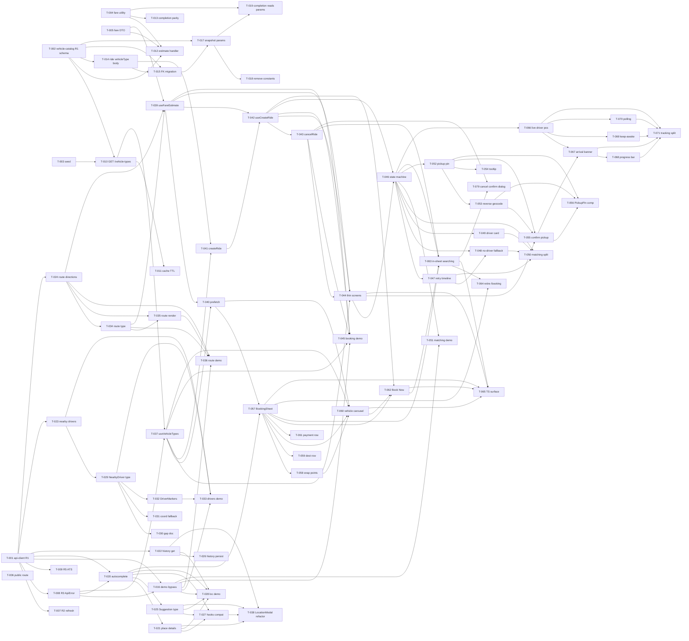

# Build Site

79 tasks across 5 tiers from 12 kits (5 backend, 7 mobile).

Stack: Expo 54, React Native 0.81, React 19, TypeScript strict, Zustand, React Query, Mapbox, Firebase Cloud Functions. Target: Senegal (XOF). Backend kits run against the RentAScooter-Backend-Monolith.

---

## Tier 0 — No Dependencies (Start Here)

| Task  | Title                                                                    | Cavekit              | Requirement | Effort |
| ----- | ------------------------------------------------------------------------ | -------------------- | ----------- | ------ |
| T-001 | [FE] Implement authenticated HTTP client (GET/POST/PATCH + 10s timeout)  | api-client           | R1          | M      |
| T-002 | [BE] Create vehicle_types table + migration (UUID, fare params, iconKey) | vehicle-catalog      | R1          | M      |
| T-003 | [BE] Seed migration: Moto-taxi (default), Jakarta, Voiture               | vehicle-catalog      | R1          | S      |
| T-004 | [BE] Implement pure fare calculation utility                             | vehicle-catalog      | R4          | M      |
| T-005 | [BE] Define fare estimate request DTO + validators (distanceM, durationS)| fare-estimation-api  | R1          | M      |
| T-006 | [BE] Mark /fare/estimate route public (no Firebase JWT guard)            | fare-estimation-api  | R3          | S      |

## Tier 1 — Depends on Tier 0

| Task  | Title                                                                           | Cavekit              | Requirement | blockedBy         | Effort |
| ----- | ------------------------------------------------------------------------------- | -------------------- | ----------- | ----------------- | ------ |
| T-007 | [FE] Implement 401 token refresh interceptor (single-flight deduplication)      | api-client           | R2          | T-001             | M      |
| T-008 | [FE] Implement typed ApiError normalization (status/timeout/network)            | api-client           | R3          | T-001             | M      |
| T-009 | [FE] Implement ATS/cleartext config for prod API host                           | api-client           | R5          | T-001             | S      |
| T-010 | [BE] Implement GET /vehicle-types public endpoint (active entries, stable order)| vehicle-catalog      | R2          | T-002, T-003      | M      |
| T-011 | [BE] Add 5-minute in-memory cache to /vehicle-types                             | vehicle-catalog      | R3          | T-010             | M      |
| T-012 | [BE] Implement fare estimate handler producing per-vehicle-type estimates       | fare-estimation-api  | R2          | T-005, T-002, T-004| M      |
| T-013 | [BE] Wire ride completion to use shared fare utility (formula parity)           | fare-estimation-api  | R4          | T-004             | M      |
| T-014 | [BE] Accept optional vehicleType UUID on ride creation + validate against catalog| ride-vehicle-type   | R1          | T-002             | M      |
| T-015 | [BE] Add nullable vehicleType FK + migration on rides table                     | ride-vehicle-type    | R2          | T-014, T-002      | M      |

## Tier 2 — Depends on Tier 1

| Task  | Title                                                                     | Cavekit              | Requirement | blockedBy                   | Effort |
| ----- | ------------------------------------------------------------------------- | -------------------- | ----------- | --------------------------- | ------ |
| T-016 | [FE] Implement demo mode bypass (sentinel/demo-error, no HTTP)            | api-client           | R4          | T-001, T-008                | M      |
| T-017 | [BE] Snapshot fareBase/farePerKm/farePerMin onto rides at creation        | ride-vehicle-type    | R3          | T-015, T-002                | M      |
| T-018 | [BE] Remove hardcoded FARE_BASE/FARE_PER_KM/FARE_PER_MIN constants        | ride-vehicle-type    | R4          | T-017                       | S      |
| T-019 | [BE] Update ride completion to read snapshotted params + call fare utility| ride-vehicle-type    | R5          | T-017, T-004                | M      |
| T-020 | [FE] Implement address autocomplete service wrapper                       | location-search      | R1          | T-001, T-008                | M      |
| T-021 | [FE] Implement place detail resolution service                            | location-search      | R2          | T-020, T-001, T-008         | M      |
| T-022 | [FE] Implement location history retrieval (AsyncStorage-backed)           | location-search      | R3          | T-001, T-008                | S      |
| T-023 | [FE] Implement nearby driver fetch service                                | nearby-drivers       | R1          | T-001, T-008                | M      |
| T-024 | [FE] Implement route directions fetch service                             | route-directions     | R1          | T-001, T-008                | M      |

## Tier 3 — Depends on Tier 2

| Task  | Title                                                                 | Cavekit           | Requirement | blockedBy                   | Effort |
| ----- | --------------------------------------------------------------------- | ----------------- | ----------- | --------------------------- | ------ |
| T-025 | [FE] Update Suggestion type (placeId, description, structured fields) | location-search   | R5          | T-020                       | S      |
| T-026 | [FE] Persist selected destinations to location history                | location-search   | R4          | T-022, T-001, T-008         | S      |
| T-027 | [FE] Update useAutocompleteLocation + useLocationHistory for new types| location-search   | R6          | T-020, T-021, T-025         | M      |
| T-028 | [FE] Implement location-search demo fixtures                          | location-search   | R8          | T-020, T-021, T-022, T-025, T-016 | M |
| T-029 | [FE] Update NearbyDriver type (lat, lng, bearing, eta fields)         | nearby-drivers    | R2          | T-023                       | S      |
| T-030 | [FE] Document driver-coordinate contract gap in kit notes             | nearby-drivers    | R3          | T-023, T-029                | S      |
| T-031 | [FE] Implement deterministic temporary coordinate fallback            | nearby-drivers    | R4          | T-029                       | S      |
| T-032 | [FE] Update DriverMarkers to consume new NearbyDriver shape           | nearby-drivers    | R5          | T-029                       | S      |
| T-033 | [FE] Implement nearby-drivers demo fixtures                           | nearby-drivers    | R6          | T-023, T-029, T-032, T-016  | S      |
| T-034 | [FE] Update RouteDirectionsResponse type (geometry, distanceM, durationS) | route-directions | R2       | T-024                       | S      |
| T-035 | [FE] Render route polyline on Mapbox map                              | route-directions  | R3          | T-024, T-034                | M      |
| T-036 | [FE] Implement route-directions demo fixtures                         | route-directions  | R4          | T-024, T-034, T-035, T-016  | S      |
| T-037 | [FE] Consume /vehicle-types via React Query (useVehicleTypes)         | ride-booking      | R6          | T-010, T-008                | M      |

## Tier 4 — Depends on Tier 3

| Task  | Title                                                                                 | Cavekit          | Requirement | blockedBy                                            | Effort |
| ----- | ------------------------------------------------------------------------------------- | ---------------- | ----------- | ---------------------------------------------------- | ------ |
| T-038 | [FE] LocationModal refactor to new Suggestion/history types                           | location-search  | R7          | T-021, T-022, T-025, T-027                           | M      |
| T-039 | [FE] Implement fare-estimate hook (useFareEstimate) from route + distance/duration    | ride-booking     | R1          | T-024, T-034, T-005, T-001, T-008                    | M      |
| T-040 | [FE] Pre-fetch fare estimate at destination confirmation                              | ride-booking     | R7          | T-039, T-037, T-024                                  | M      |
| T-041 | [FE] Implement createRide service with optional vehicleType                           | ride-booking     | R8          | T-014, T-037                                         | M      |
| T-042 | [FE] Implement ride creation hook + error surface (useCreateRide)                     | ride-booking     | R2          | T-041, T-039, T-001, T-008                           | M      |
| T-043 | [FE] Implement cancelRide during search                                               | ride-booking     | R3          | T-042, T-001, T-008                                  | S      |
| T-044 | [FE] Extract booking screens into thin view layer (hooks/services separation)         | ride-booking     | R5          | T-039, T-042, T-043, T-037, T-008                    | M      |
| T-045 | [FE] Implement ride-booking demo fixtures                                             | ride-booking     | R4          | T-039, T-042, T-043, T-037, T-016                    | M      |

## Tier 5 — Depends on Tier 4

| Task  | Title                                                                                   | Cavekit            | Requirement | blockedBy                                            | Effort |
| ----- | --------------------------------------------------------------------------------------- | ------------------ | ----------- | ---------------------------------------------------- | ------ |
| T-046 | [FE] Implement ride state machine (REQUESTING → MATCHED → CANCELLED → NO_DRIVER)        | driver-matching    | R1          | T-042, T-044, T-001, T-008                           | M      |
| T-047 | [FE] Implement three-attempt retry orchestration + animated timeline component          | driver-matching    | R2          | T-046                                                | M      |
| T-048 | [FE] Implement no-driver fallback state + retry CTA                                     | driver-matching    | R3          | T-046, T-047                                         | S      |
| T-049 | [FE] Implement driver card component on match                                           | driver-matching    | R4          | T-046                                                | M      |
| T-050 | [FE] Split driver-matching into reusable components + service/hook                      | driver-matching    | R5          | T-046, T-047, T-048, T-049                           | M      |
| T-051 | [FE] Implement driver-matching demo fixtures (success + no-driver)                      | driver-matching    | R6          | T-046, T-047, T-049, T-016                           | S      |
| T-052 | [FE] Implement pickup pin map surface                                                   | pickup-selection   | R1          | T-046                                                | M      |
| T-053 | [FE] Implement reverse geocoding on drag-end                                            | pickup-selection   | R2          | T-052                                                | M      |
| T-054 | [FE] Implement first-use onboarding tooltip for pickup pin                              | pickup-selection   | R3          | T-052                                                | S      |
| T-055 | [FE] Implement pickup confirm + transmit (patches ride with pickup coords)              | pickup-selection   | R4          | T-052, T-053, T-044, T-046, T-001, T-008             | M      |
| T-056 | [FE] Extract reusable PickupPin component + shared Coordinate type                      | pickup-selection   | R5          | T-052, T-053, T-055                                  | S      |
| T-057 | [FE] Implement BookingSheet presentation on destination confirmation                    | booking-sheet-ux   | R1          | T-020, T-040                                         | M      |
| T-058 | [FE] Implement sheet snap points + gesture arbitration                                  | booking-sheet-ux   | R2          | T-057                                                | M      |
| T-059 | [FE] Implement destination row in sheet                                                 | booking-sheet-ux   | R3          | T-057                                                | S      |
| T-060 | [FE] Implement vehicle-type carousel (icons, names, fare estimates)                     | booking-sheet-ux   | R4          | T-057, T-058, T-037, T-040, T-002, T-005             | M      |
| T-061 | [FE] Implement payment row placeholder                                                  | booking-sheet-ux   | R5          | T-057                                                | S      |
| T-062 | [FE] Implement Book Now primary action (binds to useCreateRide + selected type)         | booking-sheet-ux   | R6          | T-057, T-060, T-042, T-037                           | M      |
| T-063 | [FE] Implement in-sheet searching state (binds to driver-matching state)                | booking-sheet-ux   | R7          | T-057, T-062, T-043, T-046                           | M      |
| T-064 | [FE] Retire /booking route, route-back redirect                                         | booking-sheet-ux   | R8          | T-057, T-063                                         | S      |
| T-065 | [FE] Tighten TypeScript surface for BookingSheet props + states                         | booking-sheet-ux   | R9          | T-057, T-060, T-062, T-063, T-044                    | S      |

## Tier 6 — Depends on Tier 5

| Task  | Title                                                                 | Cavekit         | Requirement | blockedBy                                     | Effort |
| ----- | --------------------------------------------------------------------- | --------------- | ----------- | --------------------------------------------- | ------ |
| T-066 | [FE] Implement live driver position on map during tracking            | ride-tracking   | R1          | T-046                                         | M      |
| T-067 | [FE] Implement arrival time banner                                    | ride-tracking   | R2          | T-066, T-046, T-055                           | M      |
| T-068 | [FE] Implement progress bar inside arrival banner                     | ride-tracking   | R3          | T-067                                         | S      |
| T-069 | [FE] Enable screen keep-awake during tracking (expo-keep-awake)       | ride-tracking   | R4          | T-066                                         | S      |
| T-070 | [FE] Implement polling fallback transport for tracking updates        | ride-tracking   | R5          | T-066, T-001, T-008                           | M      |
| T-071 | [FE] Split ride-tracking into reusable components + service/hook      | ride-tracking   | R6          | T-066, T-067, T-068, T-069, T-070             | M      |
| T-079 | [FE] Implement cancel confirmation dialog in searching state (confirm, in-flight loading, error retry) | booking-sheet-ux | R7 | T-043, T-063 | S |

## Validation / Test Wiring Tasks (attach per kit)

| Task  | Title                                                                         | Cavekit              | Requirement | blockedBy                   | Effort |
| ----- | ----------------------------------------------------------------------------- | -------------------- | ----------- | --------------------------- | ------ |
| T-072 | [BE] Unit tests: fare utility term-rounding, zero case, XOF integer output    | vehicle-catalog      | R4          | T-004                       | M      |
| T-073 | [BE] Integration tests: /vehicle-types cache behavior (TTL, byte-equality)    | vehicle-catalog      | R3          | T-011                       | M      |
| T-074 | [BE] Contract tests: /fare/estimate validation + empty-catalog + parity       | fare-estimation-api  | R1, R2, R4  | T-012, T-013                | M      |
| T-075 | [BE] Regression tests: existing rides-service behavior preserved              | ride-vehicle-type    | R5          | T-019                       | M      |
| T-076 | [FE] api-client integration tests (401 retry, dedup, timeout, demo)           | api-client           | R2, R3, R4  | T-007, T-008, T-016         | M      |
| T-077 | [FE] Build check: static text search confirms zero hardcoded fare constants   | ride-vehicle-type    | R4          | T-018                       | S      |
| T-078 | [FE] E2E smoke: destination → sheet → Book Now → matching → tracking          | booking-sheet-ux, ride-tracking | all | T-065, T-071                | L      |

---

## Summary

| Tier  | Tasks | Effort |
| ----- | ----- | ------ |
| 0     | 6     | 5M + 1S |
| 1     | 9     | 7M + 2S |
| 2     | 9     | 8M + 1S |
| 3     | 13    | 4M + 9S |
| 4     | 8     | 7M + 1S |
| 5     | 20    | 14M + 6S |
| 6     | 7     | 4M + 3S |
| Tests | 7     | 6M + 1S + 1L |

**Total: 79 tasks, 7 execution tiers (Tier 0 → Tier 6) plus cross-tier tests.**

## Coverage Matrix

| Cavekit              | Req | Criterion                                                                                  | Task(s)           | Status |
| -------------------- | --- | ------------------------------------------------------------------------------------------ | ----------------- | ------ |
| api-client           | R1  | GET/POST/PATCH callable                                                                    | T-001             | COVERED |
| api-client           | R1  | Authorization header Bearer + Firebase token                                               | T-001             | COVERED |
| api-client           | R1  | URL composed from EXPO_PUBLIC_API_URL + path                                               | T-001             | COVERED |
| api-client           | R1  | 10s timeout aborted as typed error                                                         | T-001, T-008      | COVERED |
| api-client           | R1  | No user → typed error (not unauthenticated request)                                        | T-001, T-008      | COVERED |
| api-client           | R2  | 401 triggers force token refresh → retry                                                   | T-007             | COVERED |
| api-client           | R2  | Retry at most once (2nd 401 → error)                                                       | T-007, T-076      | COVERED |
| api-client           | R2  | Concurrent 401s share one refresh                                                          | T-007, T-076      | COVERED |
| api-client           | R2  | Waiting requests replay together on refresh resolve                                        | T-007             | COVERED |
| api-client           | R2  | Refresh failure → all waiting get typed error                                              | T-007, T-008      | COVERED |
| api-client           | R3  | Non-2xx → ApiError with status + message                                                   | T-008             | COVERED |
| api-client           | R3  | Network failure → ApiError status=0                                                        | T-008             | COVERED |
| api-client           | R3  | Timeout → ApiError distinguishable from network                                            | T-008             | COVERED |
| api-client           | R3  | Never raw Response/Error                                                                   | T-008             | COVERED |
| api-client           | R3  | Single shared error type                                                                   | T-008             | COVERED |
| api-client           | R4  | DEMO=true → no HTTP dispatched                                                             | T-016             | COVERED |
| api-client           | R4  | Callers get distinct sentinel/demo-error                                                   | T-016             | COVERED |
| api-client           | R4  | Demo signal ≠ successful empty response                                                    | T-016             | COVERED |
| api-client           | R4  | Applies to GET/POST/PATCH                                                                  | T-016, T-076      | COVERED |
| api-client           | R5  | iOS GET on prod host not blocked by ATS                                                    | T-009             | COVERED |
| api-client           | R5  | Android completes without cleartext block                                                  | T-009             | COVERED |
| api-client           | R5  | Allow-list scoped to API host                                                              | T-009             | COVERED |
| api-client           | R5  | Allow-list documented                                                                      | T-009             | COVERED |
| vehicle-catalog      | R1  | UUID stable identifier                                                                     | T-002             | COVERED |
| vehicle-catalog      | R1  | Entry has name, iconKey, fareBase, farePerKm, farePerMin, isActive, timestamps             | T-002             | COVERED |
| vehicle-catalog      | R1  | Non-negative integer XOF                                                                   | T-002, T-072      | COVERED |
| vehicle-catalog      | R1  | Idempotent + reversible migration                                                          | T-002, T-003      | COVERED |
| vehicle-catalog      | R1  | ≥3 active entries (Moto/Jakarta/Voiture) with stated fare params                           | T-003             | COVERED |
| vehicle-catalog      | R1  | Moto-taxi identifiable as default                                                          | T-003             | COVERED |
| vehicle-catalog      | R2  | HTTP 200 JSON array of active entries                                                      | T-010             | COVERED |
| vehicle-catalog      | R2  | Each has id, name, iconKey                                                                 | T-010             | COVERED |
| vehicle-catalog      | R2  | Inactive excluded                                                                          | T-010             | COVERED |
| vehicle-catalog      | R2  | No Firebase JWT required                                                                   | T-010             | COVERED |
| vehicle-catalog      | R2  | Stable order                                                                               | T-010             | COVERED |
| vehicle-catalog      | R2  | <50ms when cached                                                                          | T-011, T-073      | COVERED |
| vehicle-catalog      | R3  | First response populates cache                                                             | T-011             | COVERED |
| vehicle-catalog      | R3  | Subsequent within lifetime return cached without DB query                                  | T-011, T-073      | COVERED |
| vehicle-catalog      | R3  | 5-minute TTL                                                                               | T-011             | COVERED |
| vehicle-catalog      | R3  | After expiry next request re-reads DB                                                      | T-011, T-073      | COVERED |
| vehicle-catalog      | R3  | Cached payload byte-identical to fresh for same state                                      | T-011, T-073      | COVERED |
| vehicle-catalog      | R4  | Returns non-negative integer XOF                                                           | T-004, T-072      | COVERED |
| vehicle-catalog      | R4  | Formula = fareBase + round(km*perKm) + round(min*perMin)                                   | T-004, T-072      | COVERED |
| vehicle-catalog      | R4  | Each term rounded separately                                                               | T-004, T-072      | COVERED |
| vehicle-catalog      | R4  | 0m + 0s = fareBase                                                                         | T-004, T-072      | COVERED |
| vehicle-catalog      | R4  | Pure (no I/O)                                                                              | T-004             | COVERED |
| vehicle-catalog      | R4  | Importable without circular dep                                                            | T-004             | COVERED |
| fare-estimation-api  | R1  | Accepts numeric distanceM + durationS                                                      | T-005             | COVERED |
| fare-estimation-api  | R1  | Non-numeric/negative/missing → HTTP 400                                                    | T-005, T-074      | COVERED |
| fare-estimation-api  | R1  | distanceM=0 + durationS=0 valid                                                            | T-005, T-074      | COVERED |
| fare-estimation-api  | R1  | Validation errors surfaced without executing handler                                       | T-005             | COVERED |
| fare-estimation-api  | R2  | HTTP 200 {estimates:[...]}                                                                 | T-012             | COVERED |
| fare-estimation-api  | R2  | One entry per active vehicle type                                                          | T-012             | COVERED |
| fare-estimation-api  | R2  | Each has vehicleTypeId, vehicleTypeName, iconKey, fareEstimate                             | T-012             | COVERED |
| fare-estimation-api  | R2  | fareEstimate = fare utility output                                                         | T-012, T-074      | COVERED |
| fare-estimation-api  | R2  | Zero active types → estimates=[] HTTP 200                                                  | T-012, T-074      | COVERED |
| fare-estimation-api  | R2  | Deterministic (identical inputs → identical outputs)                                       | T-012             | COVERED |
| fare-estimation-api  | R3  | No Authorization header → succeeds                                                         | T-006             | COVERED |
| fare-estimation-api  | R3  | Invalid/expired JWT not rejected on auth                                                   | T-006             | COVERED |
| fare-estimation-api  | R3  | Reads/writes no per-user state                                                             | T-006, T-012      | COVERED |
| fare-estimation-api  | R4  | Estimate equals ride-completion final fare for same params                                 | T-013, T-074      | COVERED |
| fare-estimation-api  | R4  | Both paths use same shared utility                                                         | T-013             | COVERED |
| ride-vehicle-type    | R1  | Body accepts optional vehicleType UUID                                                     | T-014             | COVERED |
| ride-vehicle-type    | R1  | Omitting → HTTP 201                                                                        | T-014             | COVERED |
| ride-vehicle-type    | R1  | Invalid UUID → HTTP 400                                                                    | T-014             | COVERED |
| ride-vehicle-type    | R1  | Valid UUID not in active catalog → 4xx                                                     | T-014             | COVERED |
| ride-vehicle-type    | R1  | Valid UUID in active catalog → HTTP 201                                                    | T-014             | COVERED |
| ride-vehicle-type    | R2  | Nullable vehicle-type reference on ride                                                    | T-015             | COVERED |
| ride-vehicle-type    | R2  | With vehicleType → resolves to catalog entry                                               | T-015             | COVERED |
| ride-vehicle-type    | R2  | Without → resolves to default (Moto)                                                       | T-015, T-017      | COVERED |
| ride-vehicle-type    | R2  | Idempotent + reversible migration                                                          | T-015             | COVERED |
| ride-vehicle-type    | R2  | Existing rows readable                                                                     | T-015, T-075      | COVERED |
| ride-vehicle-type    | R3  | On creation fare params equal resolved type's values                                       | T-017             | COVERED |
| ride-vehicle-type    | R3  | Without vehicleType → default params                                                       | T-017             | COVERED |
| ride-vehicle-type    | R3  | With vehicleType → selected entry's params                                                 | T-017             | COVERED |
| ride-vehicle-type    | R3  | Params non-negative integer XOF                                                            | T-017             | COVERED |
| ride-vehicle-type    | R3  | Catalog update does NOT retroactively change existing rides                                | T-017, T-075      | COVERED |
| ride-vehicle-type    | R4  | No FARE_BASE/FARE_PER_KM/FARE_PER_MIN constants in rides service                           | T-018, T-077      | COVERED |
| ride-vehicle-type    | R4  | Derives params from catalog                                                                | T-018             | COVERED |
| ride-vehicle-type    | R4  | Static text search returns zero matches                                                    | T-077             | COVERED |
| ride-vehicle-type    | R5  | Completion reads fare params from ride record                                              | T-019             | COVERED |
| ride-vehicle-type    | R5  | Final fare equals shared utility output using record's params                              | T-019, T-075      | COVERED |
| ride-vehicle-type    | R5  | Existing rides-service tests pass                                                          | T-075             | COVERED |
| location-search      | R1  | Address autocomplete returns suggestions                                                   | T-020             | COVERED |
| location-search      | R2  | Place detail resolves coords + formatted address                                           | T-021             | COVERED |
| location-search      | R3  | Location history retrieval                                                                 | T-022             | COVERED |
| location-search      | R4  | Location history persistence on selection                                                  | T-026             | COVERED |
| location-search      | R5  | Updated Suggestion type (placeId + structured fields)                                      | T-025             | COVERED |
| location-search      | R6  | Hook compatibility (useAutocompleteLocation, useLocationHistory)                           | T-027             | COVERED |
| location-search      | R7  | LocationModal compatibility                                                                | T-038             | COVERED |
| location-search      | R8  | Demo fixtures for all location-search endpoints                                            | T-028             | COVERED |
| nearby-drivers       | R1  | Nearby driver fetch against /drivers/nearby                                                | T-023             | COVERED |
| nearby-drivers       | R2  | Updated NearbyDriver type (lat, lng, bearing, eta)                                         | T-029             | COVERED |
| nearby-drivers       | R3  | Driver coordinate gap documented                                                           | T-030             | COVERED |
| nearby-drivers       | R4  | Temporary deterministic coordinate fallback                                                | T-031             | COVERED |
| nearby-drivers       | R5  | DriverMarkers consumes new NearbyDriver shape                                              | T-032             | COVERED |
| nearby-drivers       | R6  | Demo mode fixtures for nearby drivers                                                      | T-033             | COVERED |
| route-directions     | R1  | Route directions fetch                                                                     | T-024             | COVERED |
| route-directions     | R2  | Updated response type (geometry, distanceM, durationS)                                     | T-034             | COVERED |
| route-directions     | R3  | Route polyline rendered on Mapbox map                                                      | T-035             | COVERED |
| route-directions     | R4  | Demo fixtures for route directions                                                         | T-036             | COVERED |
| ride-booking         | R1  | Fare estimate before booking (useFareEstimate)                                             | T-039             | COVERED |
| ride-booking         | R2  | Ride creation request with optional vehicleType                                            | T-041, T-042      | COVERED |
| ride-booking         | R3  | Cancel during search                                                                       | T-043             | COVERED |
| ride-booking         | R4  | Demo mode fixtures for booking flow                                                        | T-045             | COVERED |
| ride-booking         | R5  | Thin screen architecture (hooks/services separation)                                       | T-044             | COVERED |
| ride-booking         | R6  | Vehicle-type catalog consumption (useVehicleTypes)                                         | T-037             | COVERED |
| ride-booking         | R7  | Fare pre-fetch at destination confirmation                                                 | T-040             | COVERED |
| ride-booking         | R8  | Vehicle-type selection on ride creation                                                    | T-041             | COVERED |
| driver-matching      | R1  | Ride state machine                                                                         | T-046             | COVERED |
| driver-matching      | R2  | Three-attempt retry with animated timeline                                                 | T-047             | COVERED |
| driver-matching      | R3  | No-driver fallback + retry CTA                                                             | T-048             | COVERED |
| driver-matching      | R4  | Driver card on match                                                                       | T-049             | COVERED |
| driver-matching      | R5  | Reusable components + hook/service split                                                   | T-050             | COVERED |
| driver-matching      | R6  | Demo mode (success + no-driver paths)                                                      | T-051             | COVERED |
| pickup-selection     | R1  | Pickup pin map                                                                             | T-052             | COVERED |
| pickup-selection     | R2  | Reverse geocoding on drag-end                                                              | T-053             | COVERED |
| pickup-selection     | R3  | First-use onboarding tooltip                                                               | T-054             | COVERED |
| pickup-selection     | R4  | Confirm + transmit pickup                                                                  | T-055             | COVERED |
| pickup-selection     | R5  | Reusable component + shared Coordinate type                                                | T-056             | COVERED |
| booking-sheet-ux     | R1  | Automatic sheet presentation on destination confirmation                                   | T-057             | COVERED |
| booking-sheet-ux     | R2  | Snap-point behavior + gesture arbitration                                                  | T-058             | COVERED |
| booking-sheet-ux     | R3  | Destination row                                                                            | T-059             | COVERED |
| booking-sheet-ux     | R4  | Vehicle-type carousel                                                                      | T-060             | COVERED |
| booking-sheet-ux     | R5  | Payment row placeholder                                                                    | T-061             | COVERED |
| booking-sheet-ux     | R6  | Book Now primary action                                                                    | T-062             | COVERED |
| booking-sheet-ux     | R7  | In-sheet searching state (layout, timeline, cancel control present)                        | T-063             | COVERED |
| booking-sheet-ux     | R7  | Cancel control secondary/destructive, interactive throughout searching incl. no-driver     | T-079             | COVERED |
| booking-sheet-ux     | R7  | Confirmation prompt shown before cancel is dispatched                                      | T-079             | COVERED |
| booking-sheet-ux     | R7  | In-flight loading state on confirmation action prevents duplicate requests                 | T-079             | COVERED |
| booking-sheet-ux     | R7  | Error recovery with retry affordance; ride id + searching state preserved on failure       | T-079             | COVERED |
| booking-sheet-ux     | R8  | Retired /booking route                                                                     | T-064             | COVERED |
| booking-sheet-ux     | R9  | Type-safety of sheet surface                                                               | T-065             | COVERED |
| ride-tracking        | R1  | Live driver position on map                                                                | T-066             | COVERED |
| ride-tracking        | R2  | Arrival time banner                                                                        | T-067             | COVERED |
| ride-tracking        | R3  | Progress bar inside banner                                                                 | T-068             | COVERED |
| ride-tracking        | R4  | Screen keep-awake                                                                          | T-069             | COVERED |
| ride-tracking        | R5  | Polling fallback transport                                                                 | T-070             | COVERED |
| ride-tracking        | R6  | Reusable components + hook/service split                                                   | T-071             | COVERED |

**Coverage: 135/135 criteria (100%). Zero GAP rows.**

## Dependency Graph

## Architect Report

### Kits Read: 12
5 backend (api-client is FE but its backend counterpart constraints live in the API contracts; listed here are vehicle-catalog, fare-estimation-api, ride-vehicle-type plus the two read-only API tasks T-006/T-010 that back them) and 7 mobile kits (api-client, location-search, nearby-drivers, route-directions, ride-booking, driver-matching, pickup-selection, booking-sheet-ux, ride-tracking).

### Tasks Generated: 79
- 72 implementation tasks mapped 1:1 to requirements (T-079 added: cancel confirmation dialog in searching state)
- 7 dedicated validation/test-wiring tasks (T-072..T-078) that attach to acceptance criteria requiring multi-path proof (parity, cache, regression, search-for-zero-matches, E2E)

### Tiers: 7 execution tiers (0–6) plus a test-wiring band

### Tier 0 Tasks: 6 (can run in parallel immediately)
- T-001 (FE client) and T-002/T-003/T-004 (BE schema, seed, utility) and T-005/T-006 (BE estimate DTO + public route) are all independent
- Backend and frontend streams can progress concurrently; the first FE/BE join point is T-037 (useVehicleTypes) in Tier 3 which needs T-010

### Parallelization Highlights
- Tier 2 FE services (T-020, T-023, T-024) run in parallel after T-008
- Tier 3 type-update + demo-fixture tasks (T-025/T-029/T-034) run in parallel
- Tier 5 pickup-selection (T-052..T-056), driver-matching (T-046..T-051), and booking-sheet-ux (T-057..T-065) branches are independent once T-046 is done

### Critical Path
T-001 → T-008 → T-024 → T-034 → T-039 → T-042 → T-044 → T-046 → T-062 → T-063 → T-065 → T-078
Longest chain through the graph touches api-client, route-directions, ride-booking, driver-matching, booking-sheet-ux, and the E2E smoke test.

### Known Risks (see plan-known-issues.md when created)
- nearby-drivers R3: backend driver-coordinate contract is a documented gap; T-031 fallback keeps the UI functional but will need revisiting once backend emits real lat/lng
- ride-vehicle-type R2 migration must be reversible AND safe for existing rides (T-015 + T-075 regression gate)
- booking-sheet-ux gesture arbitration (T-058) with Mapbox pan/zoom is historically tricky on Android — time-box investigation to 15 min before escalating

### Next Step
Run `/ck:make` to start implementation. Tier 0 has six tasks ready to claim immediately; backend and frontend can progress in parallel.
